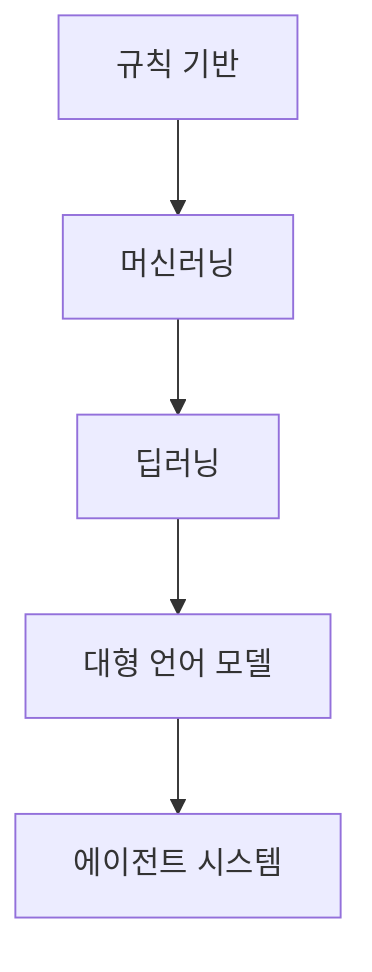

# Chapter 1. AI 패러다임의 변화

## 1. 왜 중요한가

AI 기술은 규칙 기반 시스템, 딥러닝, 대형 언어 모델(LLM), 그리고 에이전트 시스템으로 발전해 왔다. 이 변화는 단순한 모델 성능 향상을 넘어, AI의 활용 방식과 설계 패러다임 자체를 전환시켰다. 이전에는 특정 문제에 특화된 AI 시스템이 주를 이루었으나, 이제는 자신의 목표를 인식하고 다양한 도구와 상호작용하며 복잡한 문제를 해결할 수 있는 'AI 에이전트'의 시대가 도래했다. 이 패러다임 변화는 단일 모델 최적화에서 벗어나, 목적 지향적 행동, 도구 통합, 시스템 전체의 설계·운영 역량까지 필요로 한다. 실무에서 AI 시스템을 이해하고 설계하기 위해서는, 이러한 변화의 본질과 실질적 의미를 파악하는 것이 필수적이다.

## 2. 핵심 개념

### 2.1 AI 기술 발전 단계

AI의 주요 발전 흐름은 크게 규칙 기반 시스템, 머신러닝, 딥러닝, 대형 언어 모델, 그리고 에이전트 시스템으로 이어진다. 초기에는 if-then 규칙을 통해 문제를 해결했으나, 점차 데이터에서 패턴을 스스로 학습하는 머신러닝과 딥러닝이 등장했다. 이후 대규모 데이터로 사전학습된 LLM이 자연어와 코드, 복잡한 추론에 대응할 수 있게 되었고, 최근에는 도구 사용과 메모리 기능을 결합해 자율적 의사결정을 하는 에이전트 시스템으로 발전하고 있다.

#### AI 발전 단계 다이어그램



### 2.2 LLM과 에이전트 패러다임

대형 언어 모델(LLM)은 대규모 텍스트 데이터로 사전학습되어 다양한 분야의 문제에 대해 자연스럽고 문맥에 맞는 추론을 수행한다. 에이전트는 여기에 도구(외부 시스템·API), 메모리(상태 저장) 등 기능을 결합해, 단순한 질의응답을 넘어서 스스로 계획을 세우고 실행하며 목표 달성에 필요한 일련의 작업을 주도적으로 수행할 수 있다. 기존 AI가 단일 입력-출력 형태의 예측에 집중했다면, 에이전트는 환경과 상호작용하면서 계획, 실행, 평가를 반복한다.

## 3. 동작 구조

### 3.1 LLM 기반 에이전트 시스템 기본 아키텍처

LLM 기반 에이전트 시스템은 다음과 같은 흐름으로 동작한다:
- 사용자가 자연어 등으로 목표를 입력한다.
- LLM이 목표 달성을 위한 계획을 수립한다.
- 각 단계에서 필요한 도구(API, 코드 실행, 외부 시스템 등)를 호출하며 실행을 진행한다.
- 대화 및 작업 상태, 생성된 정보를 메모리에 관리한다.
- 결과를 평가하고 필요시 계획을 조정한다. 이 과정이 한 번이 아니라 반복될 수 있다.

```
목표 입력 → 계획 → 실행(도구 호출 등) → 상태 및 메모리 기록 → 반복/조정 → 완료
```

### 3.2 주요 구성 요소

- **LLM**: 자연어 입력의 의미를 해석하고 필요한 추론을 담당한다.
- **도구**: 외부 API, 데이터베이스, 코드 실행 환경 등 실질적인 작업을 수행한다.
- **메모리**: 대화 내역, 실행 이력 등 상태 정보를 저장하고 관리한다.
- **컨트롤러**: 전체 워크플로와 작업 흐름을 관리하면서 계획-실행-평가 과정을 감독한다.

## 4. 대표 패턴

### 4.1 기존 AI와 에이전트 기반 구조 비교

이전의 AI 애플리케이션은 단일 입력에 대해 예측이나 분류 결과를 산출하는 방식이 주를 이뤘다. 반면, 에이전트 기반 구조는 목표를 중심으로 계획을 세우고, 도구 활용 및 상태 관리를 반복하며 복잡한 문제를 점진적으로 해결한다. 이 과정에서 도메인 확장, 외부 환경 통합, 여러 도구와의 연동 등이 자연스럽게 이루어진다.

### 4.2 Agentic RAG의 도입

기존의 Retrieval-Augmented Generation(RAG)은 정보를 검색하고 그 결과를 바탕으로 응답을 생성하는 단일 흐름으로 작동했다. 이에 비해 Agentic RAG는 계획-실행 루프, 다중 검색, 도구 활용, 결과 검토와 재시도를 포함해 보다 유연하고 확장적인 문제 해결 방식을 지원한다.

## 5. 실무 적용 포인트

AI 에이전트 패러다임을 실무에 적용할 때는 다음 사항을 고려해야 한다. 모델 성능 최적화뿐 아니라, 목표 중심의 행동 설계, 다양한 외부 도구 연동, 워크플로 전체의 효율성 확보가 중요해진다. LLM, 도구, 메모리, 컨트롤러를 통합하는 인프라 구조 설계와, 이어지는 서비스 확장성, 신뢰성과 같은 문제도 함께 다뤄야 한다. 또한, 엔지니어와 설계자의 역할이 기존 모델 개발에서 시스템 통합, 서비스 운영, 장기 유지보수로 확대된다.

## 6. 예제 코드

프롬프트를 통해 LLM에게 '계획-실행' 사고를 요구하는 간단한 활용 방식을 코드로 보여준다.

```python
import openai  # OpenAI 혹은 호환 LLM 라이브러리 사용

def agentic_plan_and_execute(prompt):
    system_instruction = (
        "당신은 목표를 달성하기 위해 계획을 세우고 실행 단계를 설명할 수 있는 에이전트입니다. "
        "아래 목표를 읽고, 세부 계획과 실행 단계별 코드를 제안하세요."
    )
    user_prompt = f"목표: {prompt}\n계획과 단계별 실행 코드를 알려주세요."
    response = openai.ChatCompletion.create(
        model="gpt-3.5-turbo",
        messages=[
            {"role": "system", "content": system_instruction},
            {"role": "user", "content": user_prompt},
        ],
        temperature=0
    )
    return response["choices"][0]["message"]["content"]

# 사용 예시
goal = "CSV 파일에서 특정 컬럼의 평균값을 계산하세요."
print(agentic_plan_and_execute(goal))
```

이 예제에서 LLM은 입력 목표를 분석하고 해결 절차를 단계별로 출력한다. 실제 시스템에서는 이러한 계획을 바탕으로 코드 실행 환경이나 외부 도구 호출과 연동한다.

## 7. 주의할 점

에이전트 시스템은 아직 초기 단계의 기술이다. 논리적 추론, 도구 활용, 결과 평가 단계에서 예상치 않은 오류가 발생할 수 있다. LLM의 생성 능력과 실제 시스템 제어의 안정성 사이에서 설계적 균형이 필요하다. 또한, 특정 벤더나 프레임워크의 기능에 과도하게 의존하기보다, 에이전트 아키텍처의 원리를 이해하고 일반적인 구조로 설계하는 것이 중요하다.

## 8. 요약

AI 패러다임은 규칙 기반에서 딥러닝, LLM을 거쳐 에이전트 시스템으로 전환하고 있다. 도구와 메모리 활용까지 결합한 에이전트는, 목표 달성을 위해 계획, 실행, 조정의 주기를 반복하며 기존의 단일 응답형 AI보다 복잡한 상황을 자율적으로 처리한다. 이에 따라, 실무에서는 설계·운영 관점이 함께 변화할 필요가 있다. 현재 기술적 한계와 과제를 인지하고, 구조적 원리에 대한 이해를 기반으로 대응하는 것이 AI 시스템 구축에 있어 중요한 역량이 된다.

## 9. 용어 정리

- **규칙 기반 시스템(Rule-based System)**: 사람이 논리적 규칙을 직접 정의해 시스템이 정해진 규칙대로 행동하게 만든 초기 AI 방식이다. 예외 처리나 새로운 상황에 적응하는 데 한계가 있다.
- **머신러닝(Machine Learning, ML)**: 데이터를 바탕으로 패턴이나 규칙을 스스로 학습해 결과를 예측하는 AI의 한 분야다. 직접 규칙을 만드는 대신 데이터를 활용한다.
- **딥러닝(Deep Learning, DL)**: 인공신경망 구조를 사용해 데이터로부터 복잡한 표현과 특성을 자동으로 학습한다. 이미지, 음성, 자연어 등 다양한 분야에 활용된다.
- **대형 언어 모델(Large Language Model, LLM)**: 대규모 문서 데이터를 학습해 자연어, 코드, 각종 지식 문제를 문맥 기반으로 해결하는 모델이다. 대표적으로 GPT 시리즈가 있다.
- **에이전트(Agent)**: 주어진 목표를 달성하기 위해 계획을 세우고, 도구를 사용하며, 외부 환경과 상호작용하는 자율적인 소프트웨어 시스템이다.
- **도구(Tool)**: 에이전트가 외부 작업을 위해 사용하는 시스템, API, 데이터베이스 등을 의미한다.
- **메모리(Memory)**: 시스템이 대화 이력이나 상태 정보를 저장해, 문맥을 유지하거나 작업을 추적하게 하는 기능이다.
- **Agentic RAG**: 기존 RAG(Retrieval-Augmented Generation)에서 한 단계 발전해, 검색과 생성 외에도 계획-실행 반복, 도구 활용 등 다양한 흐름을 지원하는 구조다.
- **컨트롤러(Controller)**: 에이전트의 전체 동작 흐름을 관리하고 각 단계(계획, 실행, 평가)가 올바로 수행되는지 감독하는 역할을 한다.
