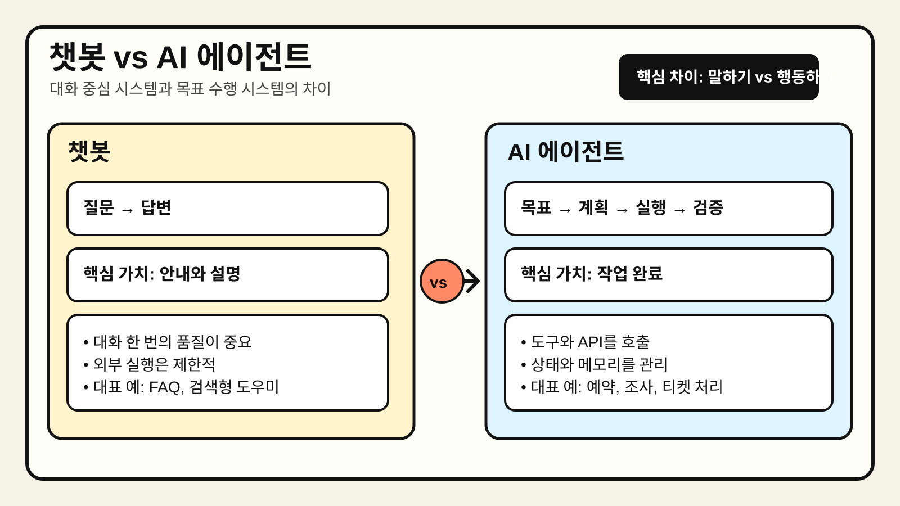

# Chapter 2. 챗봇 vs AI 에이전트



> 정해진 응답 흐름에 가까운 챗봇과, 목표를 받고 계획·도구 사용·상태 관리를 수행하는 AI 에이전트의 차이를 한 장으로 요약한 이미지다.

## 1. 왜 중요한가

실무에서 "에이전트"라는 단어는 자주 과장되어 사용된다. 단순히 LLM을 붙인 대화형 인터페이스도 에이전트라고 부르는 경우가 있고, 반대로 실제로 도구 호출과 작업 상태 관리가 포함된 시스템도 그냥 챗봇으로 취급되는 경우가 있다. 이 둘을 구분하지 않으면 아키텍처 판단이 흐려지고, 기대 수준도 잘못 설정된다.

챗봇은 여전히 매우 유용하다. 고객 문의 응대, 내부 문서 검색, FAQ 자동화처럼 대화 중심의 문제에서는 구현 비용이 낮고 운영이 단순하다. 반면 목표를 여러 단계로 쪼개고, 외부 시스템을 호출하고, 실패를 복구하며, 결과를 검증해야 하는 문제는 챗봇 구조만으로 처리하기 어렵다. 이때 필요한 것이 에이전트적 설계다.

따라서 이 장의 핵심은 "챗봇이 낡았고 에이전트가 더 고급이다"라는 단순 비교가 아니다. 어떤 문제는 챗봇으로 충분하고, 어떤 문제는 에이전트가 필요하다. 차이를 구조적으로 이해해야 적절한 수준의 시스템을 설계할 수 있다.

## 2. 핵심 개념

### 2.1 챗봇이란 무엇인가

챗봇은 사용자 입력에 대해 자연어 응답을 생성하거나, 정해진 규칙에 따라 다음 대화 흐름을 안내하는 시스템이다. 최근의 챗봇은 LLM을 사용해 훨씬 자연스럽게 응답할 수 있지만, 본질은 여전히 "대화를 통해 정보를 주고받는 인터페이스"에 가깝다. 핵심은 응답 품질과 대화 경험이다.

챗봇의 일반적 특징은 다음과 같다.

- 입력과 출력이 비교적 짧은 대화 단위로 닫힌다.
- 한 번의 요청에서 해야 할 일이 크지 않다.
- 외부 시스템 호출이 있더라도 제한적이다.
- 실패하더라도 다시 질문하면 되는 경우가 많다.
- 중요한 평가지표는 응답 정확성, 친절성, 응답 속도다.

### 2.2 AI 에이전트란 무엇인가

AI 에이전트는 사용자 목표를 입력받아, 그 목표를 달성하기 위한 여러 단계를 계획하고 실행하는 시스템이다. 이 과정에서 모델은 단순히 문장을 생성하는 역할만 하지 않는다. 필요한 도구를 선택하고, 중간 상태를 기억하고, 결과를 점검하며, 필요하면 경로를 수정한다.

에이전트의 일반적 특징은 다음과 같다.

- 목표 달성을 위해 여러 단계를 거친다.
- 도구, API, 데이터베이스, 브라우저, 코드 실행 환경 등을 호출할 수 있다.
- 중간 결과와 실행 상태를 관리한다.
- 실패 시 재시도, 우회, 사용자 확인 같은 전략을 사용할 수 있다.
- 중요한 평가지표는 작업 성공률, 비용, 지연 시간, 안정성, 통제 가능성이다.

### 2.3 핵심 차이는 "대화"가 아니라 "행동"이다

챗봇과 에이전트 모두 대화를 사용할 수 있다. 차이는 인터페이스가 아니라 시스템의 책임 범위에 있다. 챗봇은 주로 설명하고 추천하고 안내한다. 에이전트는 설명에 그치지 않고 실제 작업 흐름을 이어간다. 즉, 챗봇은 "무엇을 해야 하는지 말하는 시스템"에 가깝고, 에이전트는 "실제로 일을 진행하는 시스템"에 가깝다.

물론 모든 에이전트가 완전 자율적일 필요는 없다. 실무에서는 Human-in-the-Loop, 승인 단계, 제한된 도구 집합 같은 통제 장치를 두는 경우가 많다. 중요한 점은 에이전트가 최소한 행동 실행 단위까지 설계된 시스템이라는 것이다.

## 3. 동작 구조

### 3.1 챗봇의 기본 구조

챗봇의 기본 구조는 상대적으로 단순하다.

```text
사용자 질문 → 프롬프트 구성 → LLM 응답 생성 → 사용자에게 반환
```

검색 기능을 붙이면 다음과 같이 확장된다.

```text
사용자 질문 → 검색/RAG → 프롬프트 구성 → LLM 응답 생성 → 사용자에게 반환
```

이 구조의 핵심은 응답 한 번을 잘 만드는 것이다. 대화 문맥은 관리할 수 있지만, 일반적으로 복잡한 상태 머신이나 장기 실행 워크플로는 필요하지 않다.

### 3.2 에이전트의 기본 구조

에이전트는 보통 아래와 같은 루프를 가진다.

```text
목표 입력 → 계획 수립 → 도구 선택/실행 → 결과 관찰 → 상태 기록 → 다음 단계 결정 → 완료 또는 사용자 확인
```

이를 구성 요소로 나누면 다음과 같다.

- **모델(LLM)**: 현재 상황을 해석하고 다음 행동 후보를 제안한다.
- **도구 계층**: API, DB, 브라우저, 코드 실행기처럼 실제 작업을 수행한다.
- **메모리/상태 저장소**: 중간 결과, 사용자 선호, 실행 로그를 저장한다.
- **오케스트레이션 로직**: 루프를 돌리며 종료 조건과 실패 처리 정책을 관리한다.
- **가드레일**: 금지 작업, 승인 필요 작업, 출력 검증 규칙을 적용한다.

### 3.3 같은 질문도 구조가 달라진다

예를 들어 사용자가 "다음 주 일본 출장 준비를 도와줘"라고 말한다고 가정하자.

챗봇은 보통 준비 체크리스트, 추천 일정, 짐 목록을 답변한다. 여기까지도 충분히 유용하다.

반면 에이전트는 다음과 같은 흐름으로 확장될 수 있다.

1. 캘린더에서 출장 일정을 확인한다.
2. 항공편 메일과 호텔 예약 메일을 찾는다.
3. 출국 전 해야 할 일을 체크리스트로 정리한다.
4. 비자, 로밍, 환전 여부를 확인하기 위한 질문을 사용자에게 던진다.
5. 승인된 항목만 실제 예약 또는 리마인더 생성 작업으로 연결한다.

즉, 질문은 같아 보여도 시스템 책임은 완전히 다르다.

## 4. 대표 패턴

### 4.1 FAQ 챗봇 패턴

가장 단순한 형태다. 정적 지식베이스나 검색 인덱스를 바탕으로 질문에 답한다. 고객센터, 사내 위키, 제품 설명, 온보딩 안내에 적합하다. 실패 비용이 낮고, 응답 품질 관리도 비교적 쉽다.

적합한 경우:

- 반복 질문이 많다.
- 정답 범위가 비교적 명확하다.
- 외부 시스템을 거의 호출하지 않는다.
- 사용자 기대가 "해결"보다 "안내"에 가깝다.

### 4.2 Copilot 패턴

사용자를 대신해 전부 수행하지는 않지만, 다음 행동을 제안하고 일부 단계를 자동화하는 구조다. 코드 보조, 문서 작성 보조, 분석 쿼리 초안 생성이 대표적이다. 챗봇보다 더 적극적이지만, 최종 책임은 여전히 사용자에게 남아 있다.

적합한 경우:

- 사람의 의사결정이 핵심이다.
- 자동화보다 생산성 보조가 중요하다.
- 잘못된 실행이 곧바로 비용으로 이어질 수 있다.

### 4.3 Task Agent 패턴

명확한 목표와 제한된 도구 집합이 있을 때 적합하다. 예를 들어 티켓 분류, 리포트 작성, 데이터 정리, 정해진 API 호출 자동화가 여기에 해당한다. 범위가 제한되어 있어 통제가 비교적 쉽다.

적합한 경우:

- 입력과 산출물이 비교적 구조화되어 있다.
- 필요한 도구가 몇 가지로 제한된다.
- 성공 조건을 정의하기 쉽다.

### 4.4 General Agent처럼 보이는 시스템의 함정

여러 도구를 붙였다고 해서 자동으로 범용 에이전트가 되지는 않는다. 목표 정의, 상태 관리, 실패 처리, 권한 통제가 약하면 실제로는 "도구가 많은 챗봇"에 머무를 수 있다. 반대로 사용자가 자연어로 지시해도, 내부에서 작업 큐와 도구 호출 루프가 명확히 존재하면 그것은 에이전트에 가깝다.

## 5. 실무 적용 포인트

### 5.1 먼저 "행동 단위"를 정의한다

에이전트 설계에서는 모델 선택보다 먼저 어떤 행동을 시스템이 직접 수행할지 정해야 한다. 읽기만 할지, 쓰기까지 할지, 승인 후 실행할지, 실패 시 어디까지 자동 복구할지 결정해야 한다. 이 정의가 없으면 권한과 가드레일 설계가 불가능하다.

### 5.2 챗봇으로 충분한 문제를 굳이 에이전트로 만들지 않는다

에이전트는 강력하지만 운영 복잡도도 크다. 툴 권한, 비용, 관찰 가능성, 재시도 정책, 장애 복구까지 고려해야 한다. 질문 응답과 문서 탐색이 핵심이라면, 검색 결합형 챗봇이 더 합리적일 수 있다.

### 5.3 성공 기준을 응답 품질에서 작업 품질로 확장한다

챗봇은 답변이 자연스럽고 정확한지가 중요하다. 에이전트는 여기에 더해 실제로 일을 끝냈는지, 안전하게 끝냈는지, 잘못된 행동을 하지 않았는지를 평가해야 한다. 따라서 로그, 실행 이력, 검증 규칙, 평가셋이 더 중요해진다.

### 5.4 운영 조직의 역할도 달라진다

챗봇은 주로 프롬프트, 검색 품질, 콘텐츠 관리가 중요하다. 에이전트는 여기에 플랫폼 엔지니어링, 권한 관리, 워크플로 설계, 도구 통합, 관찰 가능성이 더해진다. 즉, 기술 스택뿐 아니라 운영 책임 구조도 달라진다.

## 6. 예제 코드

아래 예제는 같은 사용자 요청을 챗봇 방식과 에이전트 방식으로 다르게 처리하는 최소 구조를 보여준다. 실제 프로덕션 코드는 아니며, 역할 차이를 설명하기 위한 데모다.

```python
from dataclasses import dataclass
from typing import List


@dataclass
class ToolResult:
    name: str
    output: str


class SimpleChatbot:
    def reply(self, user_message: str) -> str:
        return (
            "다음 주 일본 출장을 준비할 때는 항공편, 숙소, 로밍, 환전, "
            "현지 이동 수단, 미팅 일정을 먼저 확인하는 것이 좋다. "
            f"요청한 내용: {user_message}"
        )


class TravelAgent:
    def __init__(self) -> None:
        self.memory: List[ToolResult] = []

    def call_tool(self, name: str, argument: str) -> ToolResult:
        fake_output = f"[{name}] 실행 결과: {argument}"
        result = ToolResult(name=name, output=fake_output)
        self.memory.append(result)
        return result

    def handle_goal(self, goal: str) -> str:
        self.call_tool("calendar_lookup", "다음 주 일정 확인")
        self.call_tool("mail_search", "항공편/호텔 예약 메일 검색")
        self.call_tool("todo_writer", "출장 준비 체크리스트 초안 생성")

        steps = "\n".join(f"- {item.output}" for item in self.memory)
        return (
            f"목표: {goal}\n"
            "아래 단계를 수행했다.\n"
            f"{steps}\n"
            "실제 예약이나 결제 작업은 사용자 승인 후 진행해야 한다."
        )


if __name__ == "__main__":
    chatbot = SimpleChatbot()
    print("[Chatbot]")
    print(chatbot.reply("다음 주 일본 출장 준비를 도와줘"))

    agent = TravelAgent()
    print("\n[Agent]")
    print(agent.handle_goal("다음 주 일본 출장 준비를 도와줘"))
```

이 예제에서 챗봇은 조언을 반환한다. 에이전트는 도구 호출과 상태 기록을 포함한 작업 흐름을 가진다. 실제 서비스에서는 각 도구가 캘린더 API, 메일 검색 시스템, 작업 관리 도구 등과 연결된다.

## 7. 주의할 점

첫째, 모든 멀티턴 시스템을 에이전트라고 부르면 안 된다. 여러 번 대화를 이어간다고 해서 곧바로 에이전트가 되는 것은 아니다. 핵심은 목표 지향적 행동과 도구 실행 루프의 존재다.

둘째, 자율성이 높을수록 품질 문제가 아니라 운영 문제가 커진다. 잘못된 API 호출, 중복 실행, 권한 오남용, 비용 급증 같은 문제가 대표적이다. 따라서 에이전트는 모델 프롬프트보다 시스템 제어면을 더 신중하게 설계해야 한다.

셋째, 챗봇과 에이전트를 이분법으로만 보면 안 된다. 실무에서는 두 구조가 섞인다. 사용자는 챗 인터페이스로 상호작용하지만, 내부에서는 특정 단계만 에이전트 루프로 동작하는 하이브리드 구조가 많다.

넷째, "범용 개인 비서"처럼 넓은 문제를 한 번에 풀려 하면 실패 확률이 높다. 초기에는 도메인과 권한 범위를 좁힌 Task Agent부터 시작하는 편이 현실적이다.

## 8. 요약

챗봇과 AI 에이전트의 차이는 겉보기 대화 경험보다 시스템의 책임 범위에 있다. 챗봇은 주로 질문에 답하고 정보를 안내하는 데 강하다. 에이전트는 목표를 기준으로 계획을 세우고, 도구를 호출하고, 상태를 관리하며, 여러 단계를 거쳐 작업을 수행한다.

실무에서는 챗봇으로 충분한 문제와 에이전트가 필요한 문제를 구분해야 한다. 이를 잘못 구분하면 불필요하게 복잡한 시스템을 만들거나, 반대로 필요한 자동화를 놓치게 된다. 따라서 먼저 문제의 행동 단위와 실패 비용을 정의한 뒤, 그에 맞는 수준의 아키텍처를 선택하는 것이 중요하다.

## 9. 용어 정리

- **챗봇(Chatbot)**: 사용자와 대화하며 질문에 답하거나 정보를 안내하는 시스템이다. 최근에는 LLM을 사용해 더 자연스러운 답변을 만들지만, 핵심 역할은 여전히 대화 인터페이스에 있다.
- **AI 에이전트(AI Agent)**: 목표를 받아 여러 단계를 계획하고, 필요한 도구를 사용하며, 상태를 관리하면서 작업을 수행하는 시스템이다. 단순 응답보다 행동 실행에 더 가깝다.
- **도구 호출(Tool Calling)**: 모델이 외부 API, 데이터베이스, 검색 시스템, 코드 실행기 등을 사용하도록 연결하는 방식이다. 에이전트의 실제 행동 능력을 만드는 핵심 요소다.
- **오케스트레이션(Orchestration)**: 계획, 실행, 검증, 종료 조건을 관리하는 제어 로직이다. 여러 단계의 작업을 안정적으로 이어 주는 역할을 한다.
- **가드레일(Guardrails)**: 허용된 행동 범위, 승인 정책, 출력 검증 규칙처럼 시스템을 안전하게 통제하는 장치다. 에이전트에서 특히 중요하다.
- **Human-in-the-Loop**: 중요한 단계에서 사람이 확인하거나 승인하는 운영 방식이다. 에이전트의 자율성과 통제 가능성 사이 균형을 맞출 때 자주 사용한다.
- **Task Agent**: 범위가 비교적 좁고 성공 조건이 명확한 업무를 수행하도록 설계한 에이전트다. 실무에서 가장 현실적으로 시작하기 좋은 형태다.
- **Copilot 패턴**: 시스템이 사람을 완전히 대체하지 않고, 초안 작성·추천·다음 행동 제안처럼 보조 역할을 수행하는 패턴이다. 자동화와 통제의 균형을 맞추기 좋다.
