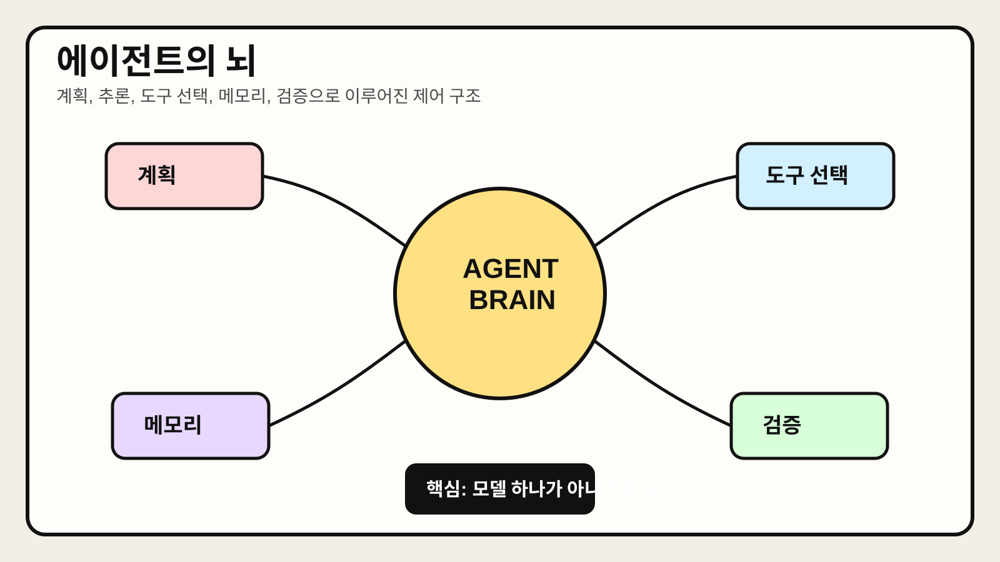

# Chapter 3. 에이전트의 뇌



> 에이전트가 단순한 한 번의 답변 생성기가 아니라, 계획·추론·도구 선택·상태 관리·검증을 결합한 제어 시스템이라는 점을 시각적으로 요약한 이미지다.

## 1. 왜 중요한가

에이전트를 처음 접하면 많은 사람이 LLM 자체를 에이전트의 전부로 생각한다. 하지만 실제 시스템에서 모델은 중심 부품일 뿐 전체는 아니다. 사용자의 목표를 해석하고, 다음 행동을 정하고, 도구를 고르고, 중간 결과를 기억하고, 실패를 처리하는 제어 구조가 함께 있어야 비로소 에이전트가 된다.

이 장에서 말하는 "에이전트의 뇌"는 생물학적 의미가 아니라, 에이전트가 무엇을 보고 어떻게 판단하며 어떤 순서로 행동할지 결정하는 인지 계층을 뜻한다. 이 계층을 이해하지 못하면 에이전트 문제를 모두 프롬프트 조정으로 해결하려 하게 된다. 그러나 실무에서는 모델 성능보다 상태 설계, 도구 인터페이스, 루프 제어가 더 큰 차이를 만드는 경우가 많다.

따라서 이 장은 LLM을 하나의 마법 상자로 보는 관점을 넘어, 에이전트의 사고 과정을 시스템 설계 관점에서 분해해 이해하는 데 목적이 있다.

## 2. 핵심 개념

### 2.1 에이전트의 뇌는 하나의 모델이 아니다

에이전트의 뇌는 보통 다음 요소의 결합으로 구성된다.

- 목표를 해석하는 부분
- 다음 행동을 결정하는 정책
- 도구를 선택하고 호출하는 인터페이스
- 메모리와 상태를 조회하는 메커니즘
- 결과를 평가하고 종료 여부를 판단하는 루프

LLM은 이 가운데 추론과 의사결정의 상당 부분을 담당할 수 있지만, 상태 저장이나 실행 보장까지 혼자 담당하지는 못한다. 그래서 실무에서는 "모델 + 오케스트레이션 로직 + 상태 계층"을 함께 설계해야 한다.

### 2.2 사고, 계획, 행동은 분리해서 보는 편이 좋다

에이전트 내부를 이해할 때는 세 가지 층위를 구분하는 것이 유용하다.

- **사고(Reasoning)**: 현재 상황을 해석하고 가능한 다음 행동을 떠올리는 과정이다.
- **계획(Planning)**: 목표 달성을 위해 단계와 순서를 정하는 과정이다.
- **행동(Acting)**: 실제 도구를 호출하고 결과를 환경에 반영하는 과정이다.

이 세 요소는 한 번에 일어날 수도 있고, 여러 번 반복되는 루프로 구성될 수도 있다. 중요한 점은 이들을 분리해 보면 어디서 문제가 생겼는지 더 잘 파악할 수 있다는 것이다. 예를 들어 잘못된 API 호출은 행동 계층 문제일 수 있고, 쓸데없이 긴 작업 경로는 계획 계층 문제일 수 있다.

### 2.3 메모리는 단순 대화 기록이 아니다

많은 초보 구현은 메모리를 대화 히스토리 정도로만 취급한다. 하지만 에이전트에서 메모리는 더 넓은 의미를 가진다.

- 사용자 선호나 제약 조건
- 이전 단계의 중간 결과
- 사용 가능한 도구 목록과 실패 이력
- 장기 태스크의 진행 상태
- 검증 결과와 후속 조치 기록

즉, 메모리는 문맥 유지뿐 아니라 의사결정 품질과 안정성을 높이는 핵심 장치다.

## 3. 동작 구조

### 3.1 가장 단순한 인지 루프

에이전트의 뇌를 가장 단순하게 표현하면 다음과 같다.

```text
입력 관찰 → 현재 상태 해석 → 다음 행동 선택 → 도구 실행 → 결과 관찰 → 상태 갱신 → 반복
```

이 루프는 매우 단순해 보이지만, 실제로는 각 단계마다 설계 선택이 들어간다.

- 어떤 정보를 현재 상태로 볼 것인가
- 언제 도구를 호출할 것인가
- 언제 사람에게 되물을 것인가
- 언제 작업을 종료할 것인가
- 실패를 어떻게 기록하고 재시도할 것인가

### 3.2 계층형으로 보면 더 이해하기 쉽다

에이전트의 뇌를 계층형으로 나누면 다음과 같이 설명할 수 있다.

1. **목표 해석 계층**: 사용자 요청을 구조화된 목표로 바꾼다.
2. **계획 계층**: 해야 할 단계를 나누고 우선순위를 정한다.
3. **실행 계층**: 각 단계에서 적절한 도구를 호출한다.
4. **검증 계층**: 결과가 목표에 맞는지 확인한다.
5. **기억 계층**: 중간 결과와 제약 조건을 저장한다.

실제 프레임워크는 이름이 조금씩 달라도 대체로 이 구조를 포함한다.

### 3.3 도구 선택은 추론 문제이자 인터페이스 문제다

에이전트가 어떤 도구를 고르는지는 모델의 추론 능력에만 달린 문제가 아니다. 도구 설명이 명확한지, 입력 스키마가 단순한지, 실패 메시지가 이해 가능한지에 따라서도 선택 품질이 크게 달라진다. 즉, 에이전트의 뇌를 좋게 만들려면 모델만 바꾸는 것이 아니라 도구 자체를 "생각하기 쉬운 형태"로 설계해야 한다.

## 4. 대표 패턴

### 4.1 ReAct 패턴

ReAct는 reasoning과 acting을 번갈아 수행하는 대표 패턴이다. 모델이 현재까지의 관찰을 바탕으로 다음 행동을 생각하고, 도구를 호출한 뒤, 그 결과를 다시 입력으로 삼아 다음 행동을 정한다. 구조가 직관적이고 구현이 쉬워 초기 에이전트 설계에서 자주 사용된다.

장점:

- 단계별 판단 과정을 추적하기 쉽다.
- 도구 호출 루프와 잘 맞는다.
- 제한된 태스크에서 빠르게 적용할 수 있다.

주의점:

- 루프가 길어지면 비용과 지연 시간이 커질 수 있다.
- 중간 추론 품질이 낮으면 잘못된 경로가 누적될 수 있다.

### 4.2 Planner-Executor 패턴

계획과 실행을 분리하는 방식이다. 먼저 상위 계획을 세운 뒤, 각 단계를 실행기로 넘겨 처리한다. 복잡한 태스크를 다룰 때 유리하며, 멀티 에이전트 구조의 기초가 되기도 한다.

장점:

- 장기 작업을 구조적으로 관리하기 쉽다.
- 계획 수정과 실행 실패를 분리해 다룰 수 있다.

주의점:

- 계획이 지나치게 경직되면 환경 변화에 약할 수 있다.
- 계획 품질 검증이 별도로 필요하다.

### 4.3 Reflective Agent 패턴

작업 결과를 바로 확정하지 않고, 스스로 검토하거나 별도 검증 단계를 거치는 방식이다. 작성된 초안을 다시 점검하거나, 코드 결과를 테스트로 확인하는 흐름이 여기에 가깝다.

장점:

- 오류를 조기에 줄일 수 있다.
- 품질 기준을 명시적으로 적용하기 쉽다.

주의점:

- 자기 검토가 항상 신뢰할 만한 것은 아니다.
- 검증 기준이 약하면 형식적인 재검토에 그칠 수 있다.

## 5. 실무 적용 포인트

### 5.1 프롬프트보다 상태 설계를 먼저 본다

에이전트가 엉뚱한 행동을 한다고 해서 항상 모델이 문제인 것은 아니다. 현재 상태에 필요한 정보가 빠져 있거나, 도구 실행 결과가 제대로 저장되지 않거나, 종료 조건이 모호해서 생기는 경우가 많다. 따라서 디버깅할 때는 프롬프트만 보지 말고 상태 전이와 메모리 기록 구조를 먼저 살펴야 한다.

### 5.2 행동 공간을 좁혀야 뇌가 똑똑해진다

사용 가능한 도구와 선택지가 너무 많으면 모델은 오히려 불안정해진다. 초기에 성능을 높이려면 범위를 넓히기보다, 필요한 행동을 좁고 명확하게 정의하는 편이 낫다. 이는 모델 성능 한계를 감추는 편법이 아니라 시스템 설계 원칙에 가깝다.

### 5.3 추론 로그와 실행 로그를 분리해 저장한다

실무에서는 "왜 이런 결정을 했는지"와 "실제로 무엇을 실행했는지"를 분리해서 기록하는 편이 좋다. 그래야 품질 문제와 운영 문제를 अलगமாக 분석할 수 있다. 특히 권한이 있는 도구를 호출하는 에이전트에서는 실행 로그의 중요성이 더 크다.

### 5.4 검증 단계 없이는 뇌가 아니라 충동에 가깝다

작업을 끝냈다고 모델이 주장하는 것과 실제로 성공한 것은 다르다. 결과 확인, 스키마 검증, 테스트 실행, 사용자 승인 같은 확인 절차가 있어야 에이전트의 판단을 신뢰할 수 있다. 검증 없는 자율성은 쉽게 과신으로 이어진다.

## 6. 예제 코드

아래 예제는 에이전트의 뇌를 "계획 → 도구 실행 → 상태 갱신 → 검증" 구조로 단순화해 보여준다. 데모용 코드이며, 실제 서비스에서는 각 단계가 외부 시스템과 연결된다.

```python
from dataclasses import dataclass, field
from typing import List


@dataclass
class AgentState:
    goal: str
    plan: List[str] = field(default_factory=list)
    observations: List[str] = field(default_factory=list)
    done: bool = False


class SimpleAgentBrain:
    def make_plan(self, state: AgentState) -> None:
        state.plan = [
            "요청 해석",
            "관련 문서 검색",
            "초안 작성",
            "검토 후 반환",
        ]

    def choose_next_action(self, state: AgentState) -> str:
        if len(state.observations) >= len(state.plan):
            state.done = True
            return "finish"
        return state.plan[len(state.observations)]

    def execute(self, action: str) -> str:
        return f"실행 완료: {action}"

    def validate(self, state: AgentState) -> bool:
        return len(state.observations) == len(state.plan)

    def run(self, goal: str) -> AgentState:
        state = AgentState(goal=goal)
        self.make_plan(state)

        while not state.done:
            action = self.choose_next_action(state)
            if action == "finish":
                break
            result = self.execute(action)
            state.observations.append(result)
            state.done = self.validate(state)

        return state


if __name__ == "__main__":
    brain = SimpleAgentBrain()
    final_state = brain.run("고객 인터뷰 메모를 바탕으로 요약 보고서 작성")
    print("goal:", final_state.goal)
    print("plan:", final_state.plan)
    print("observations:", final_state.observations)
    print("done:", final_state.done)
```

이 예제의 핵심은 모델 호출 자체가 아니라, 에이전트가 어떤 상태를 갖고 어떤 순서로 결정을 내리는지에 있다. 실제 구현에서는 `make_plan`, `choose_next_action`, `validate`가 각각 LLM 호출, 규칙 엔진, 평가 로직 등과 연결될 수 있다.

## 7. 주의할 점

첫째, 내부 추론을 많이 노출한다고 해서 곧바로 좋은 에이전트가 되는 것은 아니다. 필요한 것은 긴 독백이 아니라, 올바른 행동 선택과 검증 가능한 실행이다.

둘째, "메모리를 많이 넣으면 더 똑똑해진다"는 생각도 위험하다. 관련 없는 상태가 계속 쌓이면 오히려 판단이 흐려지고 비용이 증가한다. 메모리는 많이 저장하는 것보다 적절히 요약하고 선택적으로 불러오는 것이 중요하다.

셋째, 계획을 세우는 기능과 실행하는 기능을 분리하지 않으면 문제 원인 분석이 어려워진다. 특히 실패가 잦은 시스템에서는 어느 계층에서 오류가 나는지 관찰 가능하게 만들어야 한다.

넷째, 에이전트의 뇌를 지나치게 범용적으로 설계하려 하면 품질이 불안정해질 수 있다. 초기에는 업무 범위를 좁히고, 필요한 판단만 잘하게 만드는 편이 더 현실적이다.

## 8. 요약

에이전트의 뇌는 하나의 LLM이 아니라, 목표 해석, 계획, 도구 선택, 메모리, 검증을 포함하는 인지·제어 구조다. 모델은 중요한 중심 부품이지만, 실제 성능과 안정성은 상태 설계와 실행 루프에 크게 좌우된다.

실무에서는 사고, 계획, 행동, 검증을 분리해 보는 습관이 중요하다. 그래야 실패 원인을 더 정확히 찾을 수 있고, 에이전트를 프롬프트 실험이 아니라 시스템 설계 문제로 다룰 수 있다.

## 9. 용어 정리

- **추론(Reasoning)**: 현재 정보로부터 무엇을 해야 할지 판단하는 과정이다. 에이전트에서는 다음 행동 후보를 정하는 데 자주 쓰인다.
- **계획(Planning)**: 목표를 달성하기 위해 단계를 나누고 순서를 정하는 과정이다. 긴 작업일수록 중요성이 커진다.
- **행동(Acting)**: 도구 호출, API 요청, 파일 수정처럼 실제 환경에 변화를 일으키는 실행 단계다.
- **상태(State)**: 현재까지의 작업 상황을 구조화해 저장한 정보다. 중간 결과, 진행 상태, 제약 조건 등이 여기에 포함된다.
- **오케스트레이션(Orchestration)**: 여러 단계의 추론과 실행을 연결하고, 종료 조건과 실패 처리 정책을 관리하는 제어 계층이다.
- **검증(Validation)**: 에이전트가 만든 결과가 목표와 규칙에 맞는지 확인하는 절차다. 테스트, 스키마 검사, 사용자 승인 등이 여기에 해당한다.
- **ReAct**: reasoning과 acting을 반복하며 문제를 해결하는 대표적 에이전트 패턴이다. 단계별 도구 사용 흐름을 만들기 쉽다.
- **Planner-Executor**: 계획 수립과 실행을 분리하는 구조다. 복잡한 작업을 더 명시적으로 관리할 수 있다.
