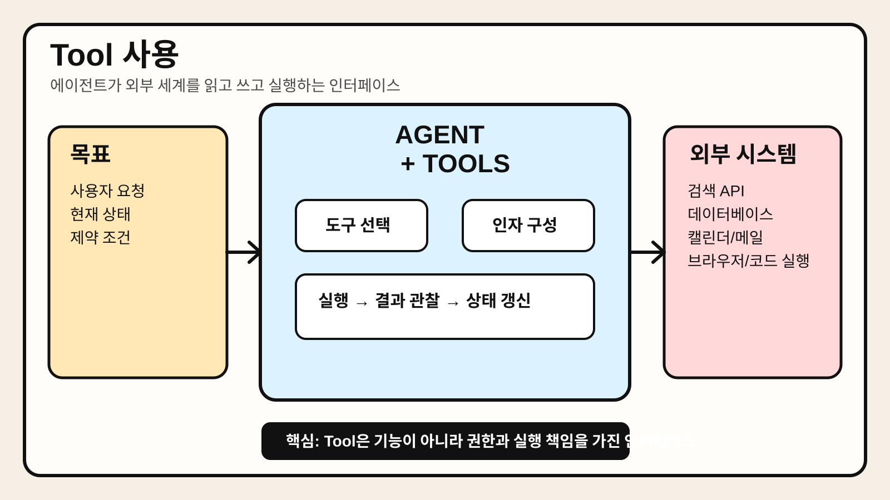

# Chapter 4. Tool 사용



> 에이전트가 단순히 답변만 생성하는 것이 아니라, 외부 시스템을 읽고 쓰고 실행하기 위해 Tool을 어떻게 선택하고 연결해야 하는지 한 장으로 요약한 이미지다.

## 1. 왜 중요한가

에이전트를 챗봇과 구분하는 가장 실질적인 요소 중 하나는 Tool 사용 능력이다. 모델이 아무리 문장을 잘 만들어도 외부 세계와 상호작용하지 못하면 실제 업무 자동화 범위는 제한적이다. 반대로 검색, 데이터베이스 조회, 코드 실행, 브라우저 제어, 사내 API 호출 같은 Tool을 안전하게 연결하면 에이전트는 설명 시스템을 넘어 행동 시스템이 된다.

실무에서는 많은 실패가 모델 자체보다 Tool 설계에서 발생한다. Tool 이름이 모호하거나, 입력 스키마가 복잡하거나, 실패 메시지가 이해하기 어렵거나, 권한 경계가 불명확하면 에이전트는 엉뚱한 행동을 하거나 불필요한 루프에 빠진다. 그래서 Tool은 단순한 부가 기능이 아니라 에이전트 아키텍처의 핵심 인터페이스로 봐야 한다.

이 장의 목적은 "Tool을 많이 붙이면 더 똑똑한 에이전트가 된다"는 단순한 관점에서 벗어나, 어떤 Tool을 어떤 방식으로 설계하고 통제해야 실무에서 안정적으로 동작하는지 이해하는 데 있다.

## 2. 핵심 개념

### 2.1 Tool은 에이전트의 손과 발이다

Tool은 에이전트가 외부 세계에 영향을 주거나 외부 정보를 가져오기 위해 사용하는 실행 인터페이스다. 예를 들면 다음과 같다.

- 검색 API로 최신 정보를 조회한다.
- 데이터베이스에서 고객 정보를 읽는다.
- 캘린더 API로 일정을 확인하거나 생성한다.
- 브라우저 자동화로 웹 페이지를 탐색한다.
- 코드 실행 환경에서 계산이나 파일 변환을 수행한다.

모델은 어떤 Tool을 언제 써야 할지 판단할 수 있지만, 실제 읽기와 쓰기, 계산과 호출은 Tool이 담당한다. 따라서 Tool이 없으면 에이전트의 행동 반경은 프롬프트 안으로만 제한된다.

### 2.2 Tool 사용은 기능 추가가 아니라 책임 확대다

Tool을 붙이는 순간 시스템 책임이 크게 넓어진다. 질문에 답하는 시스템이 아니라 실제로 무언가를 바꾸는 시스템이 되기 때문이다. 읽기 전용 Tool과 쓰기 가능 Tool의 위험도는 다르며, 결제·배포·삭제처럼 되돌리기 어려운 Tool은 더 강한 검증과 승인이 필요하다.

따라서 Tool 설계에서는 다음 질문이 중요하다.

- 이 Tool은 읽기 전용인가, 쓰기 가능한가
- 실패했을 때 복구 가능한가
- 호출 결과를 검증할 수 있는가
- 사람 승인이 필요한가
- 호출 로그를 남길 수 있는가

### 2.3 좋은 Tool은 모델이 이해하기 쉬운 Tool이다

실무에서는 기능이 많은 Tool보다 의도가 분명한 Tool이 더 잘 동작하는 경우가 많다. 예를 들어 `manage_calendar(action, payload)`처럼 범용적이지만 모호한 Tool보다, `list_events`, `create_event`, `update_event`처럼 역할이 분리된 Tool이 더 안정적이다. Tool 설명, 입력 필드 이름, 예외 메시지까지 모두 모델 친화적으로 설계해야 한다.

좋은 Tool의 특징은 다음과 같다.

- 이름만 봐도 목적이 드러난다.
- 입력 스키마가 짧고 명확하다.
- 실패 사유가 구조적으로 반환된다.
- 부작용 범위가 작고 예측 가능하다.
- 결과를 다시 모델이 읽기 좋은 형태로 반환한다.

## 3. 동작 구조

### 3.1 기본 Tool 호출 흐름

에이전트에서 Tool 호출은 보통 다음 순서로 진행된다.

```text
사용자 목표 입력 → 현재 상태 해석 → 필요한 Tool 선택 → 인자 구성 → Tool 실행 → 결과 관찰 → 상태 갱신 → 다음 단계 결정
```

여기서 중요한 점은 Tool 호출이 한 번의 함수 호출로 끝나지 않는다는 것이다. 호출 전에는 어떤 정보가 필요한지 결정해야 하고, 호출 후에는 결과를 검증하고 다음 행동에 반영해야 한다.

### 3.2 Tool 인터페이스의 구성 요소

하나의 Tool은 보통 아래 요소를 가진다.

- **이름**: Tool의 목적을 짧게 드러낸다.
- **설명**: 언제 써야 하는지, 언제 쓰면 안 되는지 알려준다.
- **입력 스키마**: 필수 인자와 선택 인자를 구조화한다.
- **실행기**: 실제 API 호출, DB 조회, 코드 실행을 수행한다.
- **결과 포맷**: 성공 결과와 실패 결과를 일관된 구조로 반환한다.
- **권한 정책**: 허용 범위, 승인 조건, 속도 제한을 정의한다.

예를 들어 같은 메일 Tool이라도 단순 조회 Tool과 메일 발송 Tool은 정책 수준이 달라야 한다.

### 3.3 읽기 Tool과 쓰기 Tool은 분리하는 편이 좋다

많은 시스템에서 가장 먼저 필요한 설계 원칙은 읽기와 쓰기의 분리다. 일정 조회와 일정 생성, 문서 검색과 문서 수정, 주문 상태 확인과 주문 취소는 같은 도메인이라도 위험이 다르다. 이를 하나의 범용 Tool로 합치면 모델이 잘못된 모드로 호출할 가능성이 커진다.

읽기 Tool은 정보 수집에 적합하고 비교적 자동화 범위를 넓히기 쉽다. 반면 쓰기 Tool은 승인, 검증, 롤백 전략을 함께 설계해야 한다.

## 4. 대표 패턴

### 4.1 Retrieval Tool 패턴

검색, 벡터 검색, SQL 조회, 내부 API 조회처럼 정보를 읽어 오는 Tool 집합이다. Agentic RAG의 기본 구성 요소이며, 사실 확인과 최신 정보 반영에 중요하다.

장점:

- 환각을 줄이는 데 도움이 된다.
- 최신 상태를 반영할 수 있다.
- 읽기 전용으로 설계하면 비교적 안전하다.

주의점:

- 검색 결과가 너무 많으면 판단이 흐려질 수 있다.
- 잘못된 문서나 오래된 데이터를 가져오면 오히려 품질이 나빠진다.

### 4.2 Action Tool 패턴

티켓 생성, 캘린더 등록, 파일 수정, 메시지 발송처럼 실제 행동을 발생시키는 Tool이다. 업무 자동화에서 가치가 크지만, 잘못 사용하면 즉시 운영 사고로 이어질 수 있다.

장점:

- 실질적인 자동화 효과가 크다.
- 사람이 하던 반복 업무를 줄일 수 있다.

주의점:

- 승인 정책과 감사 로그가 필요하다.
- 멱등성(idempotency)을 고려하지 않으면 중복 실행 문제가 발생한다.

### 4.3 Planner + Toolbelt 패턴

에이전트가 여러 Tool을 직접 고르는 대신, 상위 계획기가 단계별로 허용된 Tool 집합을 좁혀 주는 방식이다. 예를 들어 "조사 단계에서는 검색 Tool만", "실행 단계에서는 승인된 쓰기 Tool만" 허용하는 구조다.

장점:

- 행동 공간을 줄여 안정성을 높일 수 있다.
- 단계별 보안 정책을 적용하기 쉽다.

주의점:

- 오케스트레이션이 복잡해질 수 있다.
- 계획 계층이 잘못되면 필요한 Tool을 놓칠 수 있다.

## 5. 실무 적용 포인트

### 5.1 Tool 설명은 사람보다 모델을 기준으로 쓴다

사람 개발자는 범용 인터페이스를 선호할 때가 많지만, 모델은 의도가 분명하고 범위가 좁은 Tool을 더 잘 사용한다. Tool 설명에는 목적, 사용 조건, 금지 조건을 함께 적는 편이 좋다. 예를 들어 "사용자 승인 없이 외부 메시지를 보내지 말 것" 같은 문장을 명시할 수 있다.

### 5.2 입력 스키마는 짧고 단순해야 한다

필드 수가 많고 중첩 구조가 깊을수록 호출 오류가 늘어난다. 가능하면 한 Tool이 하나의 명확한 작업만 하게 하고, 필수 필드는 최소화하는 편이 좋다. 불가피하게 복잡한 입력이 필요하다면, 중간 정규화 단계를 따로 두는 것이 낫다.

### 5.3 실패 결과도 구조화해서 반환한다

단순히 `error` 문자열만 반환하면 모델이 다음 행동을 결정하기 어렵다. 실패 유형, 재시도 가능 여부, 사용자 확인 필요 여부를 구조적으로 돌려주면 루프 제어가 쉬워진다.

예를 들면 다음과 같은 정보가 유용하다.

- 에러 코드
- 사람이 읽을 메시지
- 모델이 읽을 짧은 원인 설명
- 재시도 가능 여부
- 승인 필요 여부

### 5.4 Tool 자체보다 Tool 정책이 더 중요할 때가 많다

같은 캘린더 생성 Tool이라도, 개인 일정에만 쓰는지 팀 전체 일정에도 쓰는지에 따라 위험이 달라진다. 따라서 Tool 카탈로그를 만들 때는 기능 목록뿐 아니라 소유자, 권한 범위, 감사 로그, 승인 정책, 호출 제한도 함께 문서화해야 한다.

## 6. 예제 코드

아래 예제는 읽기 Tool과 쓰기 Tool을 분리하고, 쓰기 Tool에는 승인 조건을 적용하는 최소 구조를 보여준다. 데모용 코드이며 실제 프로덕션에서는 인증, 재시도, 감사 로그가 추가되어야 한다.

```python
from dataclasses import dataclass
from typing import Any, Dict


@dataclass
class ToolResponse:
    ok: bool
    data: Dict[str, Any]
    error: str | None = None
    requires_approval: bool = False


class CalendarTools:
    def list_events(self, date: str) -> ToolResponse:
        return ToolResponse(
            ok=True,
            data={
                "date": date,
                "events": ["10:00 주간 회의", "15:00 고객 데모"],
            },
        )

    def create_event(self, title: str, date: str, approved: bool) -> ToolResponse:
        if not approved:
            return ToolResponse(
                ok=False,
                data={"title": title, "date": date},
                error="승인 없이 일정을 생성할 수 없다.",
                requires_approval=True,
            )

        return ToolResponse(
            ok=True,
            data={"title": title, "date": date, "status": "created"},
        )


if __name__ == "__main__":
    tools = CalendarTools()

    read_result = tools.list_events("2026-03-20")
    print("[READ]", read_result)

    write_result = tools.create_event(
        title="프로젝트 킥오프",
        date="2026-03-21 14:00",
        approved=False,
    )
    print("[WRITE]", write_result)
```

이 예제의 핵심은 기능 자체보다 경계 설정에 있다. 읽기와 쓰기를 분리하고, 쓰기에는 승인 플래그를 두면 에이전트가 자동화와 통제 사이 균형을 잡기 쉬워진다.

## 7. 주의할 점

첫째, Tool 수를 늘리는 것이 곧바로 성능 향상으로 이어지지는 않는다. 선택지가 많을수록 모델이 헷갈릴 가능성도 커진다. 처음에는 자주 쓰는 Tool만 좁게 제공하는 편이 낫다.

둘째, 범용 `execute_anything` 같은 Tool은 편해 보여도 위험하다. 권한 경계가 무너지고, 실패 원인 분석도 어려워진다. 가능하면 작업 단위별로 잘게 나누고 책임을 명확히 해야 한다.

셋째, Tool 결과를 자연어로만 반환하면 후속 검증이 어렵다. 사람이 읽기 좋은 요약과 함께, 모델이나 프로그램이 읽기 좋은 구조화된 필드를 함께 제공하는 편이 좋다.

넷째, 외부 시스템 호출은 항상 지연, 실패, 중복 실행 가능성을 가진다. 따라서 타임아웃, 재시도, 멱등성 키, 감사 로그 같은 운영 요소를 초기에 함께 설계해야 한다.

## 8. 요약

Tool은 에이전트가 실제로 행동하게 만드는 핵심 인터페이스다. 하지만 Tool을 많이 붙이는 것보다, 목적이 분명하고 입력이 단순하며 권한 경계가 명확한 Tool을 설계하는 것이 더 중요하다.

실무에서는 읽기와 쓰기를 분리하고, 실패 결과를 구조화하며, 승인 정책과 감사 로그를 함께 설계해야 한다. 결국 좋은 에이전트는 좋은 모델만으로 만들어지지 않고, 모델이 올바르게 사용할 수 있는 Tool 생태계 위에서 만들어진다.

## 9. 용어 정리

- **Tool**: 에이전트가 외부 시스템과 상호작용하기 위해 사용하는 실행 인터페이스다. 검색, API 호출, 파일 수정, 코드 실행 등이 여기에 포함된다.
- **Tool Calling**: 모델이 현재 목표에 맞는 Tool을 선택하고 필요한 인자를 구성해 호출하는 과정이다. 에이전트의 행동 능력을 좌우한다.
- **입력 스키마(Input Schema)**: Tool이 어떤 필드를 어떤 형식으로 받아야 하는지 정의한 구조다. 명확할수록 호출 안정성이 높아진다.
- **멱등성(Idempotency)**: 같은 요청을 여러 번 실행해도 결과가 중복되지 않도록 만드는 성질이다. 쓰기 Tool에서 특히 중요하다.
- **읽기 전용 Tool**: 정보를 조회하지만 외부 상태를 바꾸지 않는 Tool이다. 보통 자동화 범위를 더 넓게 허용하기 쉽다.
- **쓰기 Tool**: 외부 상태를 생성·수정·삭제하는 Tool이다. 승인, 검증, 감사 로그가 더 중요하다.
- **감사 로그(Audit Log)**: 누가 언제 어떤 Tool을 어떤 인자로 호출했는지 남기는 기록이다. 운영 추적성과 사고 분석에 필요하다.
- **승인 게이트(Approval Gate)**: 위험한 Tool 호출 전에 사람이나 정책 엔진의 확인을 거치게 하는 통제 장치다.