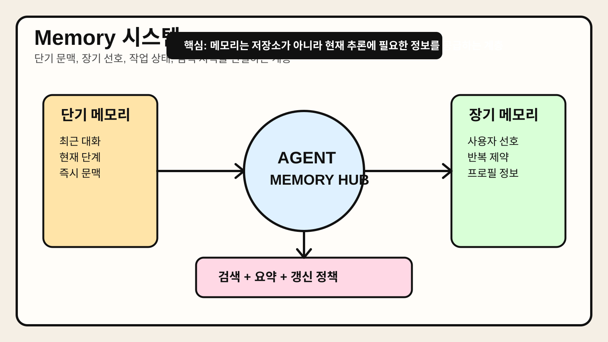

# Chapter 5. Memory 시스템



> 에이전트의 Memory가 단순한 대화 기록이 아니라, 작업 상태·사용자 선호·검색 가능한 지식·요약된 장기 문맥을 연결하는 계층이라는 점을 시각적으로 요약한 이미지다.

## 1. 왜 중요한가

에이전트가 한 번의 요청만 처리한다면 긴 메모리 구조가 꼭 필요하지 않을 수 있다. 그러나 실제 업무에서는 이전 대화, 사용자 선호, 이미 수행한 단계, 실패 이력, 외부 문서 요약 같은 상태를 이어서 사용해야 하는 경우가 많다. 이런 상태가 없으면 에이전트는 매번 처음부터 다시 시작하는 시스템이 된다.

많은 팀이 메모리를 단순히 대화 히스토리를 길게 붙이는 문제로 이해하지만, 실무의 Memory 시스템은 훨씬 넓다. 단기 문맥 관리, 장기 사실 저장, 작업 상태 추적, 검색 가능한 지식 저장소, 요약과 압축 전략이 모두 포함된다. 메모리가 잘 설계되면 에이전트는 일관성을 유지하고, 반복 질문을 줄이며, 장기 작업을 더 안정적으로 수행할 수 있다.

반대로 메모리가 무분별하면 비용과 오류가 동시에 커진다. 오래된 정보가 최신 사실처럼 섞이거나, 관련 없는 과거 문맥이 현재 판단을 흐리게 하거나, 개인 정보가 불필요하게 노출될 수 있다. 따라서 Memory 시스템은 많이 저장하는 문제가 아니라 무엇을 어떤 형태로 얼마나 오래 보존할지 결정하는 문제다.

## 2. 핵심 개념

### 2.1 메모리는 여러 층으로 나뉜다

실무에서 Memory는 보통 한 종류가 아니라 여러 층으로 나뉜다.

- **단기 메모리**: 현재 대화와 최근 작업 단계처럼 즉시 필요한 문맥이다.
- **작업 메모리**: 장기 태스크의 진행 상태, 중간 결과, 체크포인트를 저장한다.
- **장기 메모리**: 사용자 선호, 안정적인 프로필 정보, 반복적으로 쓰는 제약 조건을 저장한다.
- **지식 메모리**: 문서, 위키, 보고서, 정책처럼 검색 가능한 외부 지식 저장소다.

이 층을 구분하지 않으면 무엇을 프롬프트에 직접 넣고, 무엇을 검색해서 가져오고, 무엇을 별도 상태로 관리해야 하는지 모호해진다.

### 2.2 대화 기록은 메모리의 일부일 뿐이다

대화 히스토리는 중요하지만 그것만으로는 충분하지 않다. 예를 들어 사용자가 "나는 한국어로 짧게 답해 달라"고 말한 선호는 다음 번에도 재사용할 수 있는 장기 메모리 후보다. 반면 "이번 주 리포트의 3번 표를 수정 중"이라는 정보는 작업 메모리에 더 가깝다. 모든 정보를 동일한 텍스트 로그에만 넣으면 검색과 갱신이 어려워진다.

### 2.3 좋은 메모리는 저장보다 검색과 갱신이 중요하다

메모리가 많다고 항상 도움이 되지는 않는다. 핵심은 현재 작업에 맞는 정보를 적절히 불러오고, 오래되거나 충돌하는 정보를 갱신하는 것이다. 따라서 Memory 시스템은 저장소보다 검색 정책과 갱신 정책이 더 중요할 때가 많다.

좋은 Memory 시스템은 보통 다음 질문에 답할 수 있어야 한다.

- 어떤 정보가 장기 보존 가치가 있는가
- 이 정보는 언제 만료되거나 재검증되어야 하는가
- 현재 목표와 관련성이 높은가
- 충돌하는 정보가 있을 때 무엇을 우선할 것인가
- 모델 프롬프트에 그대로 넣을 것인가, 요약해서 넣을 것인가

## 3. 동작 구조

### 3.1 기본 Memory 루프

에이전트의 Memory 흐름은 보통 아래와 같다.

```text
입력/실행 결과 발생 → 저장 가치 판단 → 적절한 메모리 계층에 기록 → 다음 요청 시 관련 정보 검색 → 요약/압축 후 프롬프트 주입
```

즉, 메모리는 단순 아카이브가 아니라 현재 추론을 위한 재료 공급 계층이다.

### 3.2 쓰기 경로와 읽기 경로를 분리한다

Memory 시스템을 설계할 때는 무엇을 저장할지 결정하는 **쓰기 경로**와, 언제 어떤 기준으로 불러올지 결정하는 **읽기 경로**를 분리해 보는 편이 좋다.

쓰기 경로의 질문:

- 이 정보가 다시 쓰일 가능성이 높은가
- 지금 저장하면 개인정보나 보안 위험이 커지지 않는가
- 원문을 저장할지 요약본을 저장할지

읽기 경로의 질문:

- 현재 태스크와 관련성이 높은가
- 최신 정보인가
- 너무 많은 문맥을 불러와 모델 판단을 흐리지 않는가

### 3.3 요약 메모리는 컨텍스트 창의 압축 장치다

장기 대화나 복잡한 워크플로에서는 모든 이력을 그대로 넣을 수 없다. 이때 사용하는 것이 요약 메모리다. 단순 축약이 아니라, 다음 판단에 필요한 사실과 미해결 항목을 남기는 구조적 요약이 중요하다. 예를 들어 "무엇을 이미 했는지", "무엇이 아직 남았는지", "어떤 제약이 있는지"가 포함되어야 한다.

## 4. 대표 패턴

### 4.1 Conversation Buffer 패턴

최근 대화 몇 턴만 유지하는 가장 단순한 메모리 패턴이다. 구현이 쉽고 단기 대화에는 충분하다.

장점:

- 구현 비용이 낮다.
- 최근 문맥 유지에 효과적이다.

주의점:

- 대화가 길어지면 중요한 과거 사실이 사라진다.
- 장기 작업 상태 관리에는 부적합하다.

### 4.2 Summary Memory 패턴

과거 대화를 주기적으로 요약해 핵심만 유지하는 방식이다. 긴 세션에서 컨텍스트 창을 절약하는 데 유용하다.

장점:

- 긴 대화도 상대적으로 적은 토큰으로 유지할 수 있다.
- 핵심 결정과 미해결 항목을 정리하기 좋다.

주의점:

- 요약 과정에서 세부 사실이 손실될 수 있다.
- 잘못 요약된 정보가 계속 증폭될 수 있다.

### 4.3 Retrieval Memory 패턴

벡터 검색, 키워드 검색, 메타데이터 필터링을 통해 관련 메모리만 꺼내는 방식이다. 사용자 선호, 과거 프로젝트 노트, 문서 지식베이스와 잘 맞는다.

장점:

- 필요한 정보만 선택적으로 불러올 수 있다.
- 장기 지식 축적과 궁합이 좋다.

주의점:

- 검색 품질이 낮으면 관련 없는 정보가 섞인다.
- 저장 단위와 메타데이터 설계가 중요하다.

### 4.4 Episodic + Semantic 분리 패턴

과거의 사건 기록(episodic)과 일반화된 사실 지식(semantic)을 나눠 저장하는 방식이다. 예를 들어 "지난주 고객 A와 미팅함"은 사건 기록이고, "고객 A는 비용보다 배포 안정성을 중시함"은 일반화된 장기 사실에 가깝다.

장점:

- 메모리 의미를 구분해 재사용성이 높아진다.
- 오래 보존할 정보와 일시적 정보를 구별하기 쉽다.

주의점:

- 분류 기준이 모호하면 운영이 복잡해진다.

## 5. 실무 적용 포인트

### 5.1 무엇을 기억하지 않을지도 결정해야 한다

모든 것을 기억하는 것은 좋은 전략이 아니다. 일회성 잡담, 이미 무효가 된 상태, 민감하지만 재사용 가치가 낮은 정보는 저장하지 않는 편이 낫다. 메모리 비용과 개인정보 위험은 보통 시간이 갈수록 커진다.

### 5.2 장기 메모리는 사실 저장소처럼 다뤄야 한다

장기 메모리에 들어가는 정보는 "다음에도 유효한가"를 기준으로 선별해야 한다. 사용자 선호, 고정 제약, 자주 쓰는 포맷 규칙처럼 반복 가치가 있는 정보만 남기는 편이 좋다. 그리고 수정 가능성도 열어 두어야 한다.

### 5.3 작업 메모리는 로그보다 상태 머신에 가깝게 설계한다

장기 작업을 지원하려면 단순한 자연어 로그보다 구조화된 상태가 필요하다. 예를 들어 `status`, `completed_steps`, `pending_steps`, `last_error` 같은 필드를 두면 재개와 복구가 쉬워진다.

### 5.4 검색된 메모리는 그대로 믿지 말고 현재성과 관련성을 검토한다

과거의 메모리가 현재와 충돌할 수 있다. 예를 들어 예전 정책, 변경된 일정, 수정된 사용자 선호가 남아 있을 수 있다. 따라서 검색된 메모리는 참고 자료로 쓰되, 중요한 결정에는 최신 소스나 사용자 확인을 함께 거치는 편이 안전하다.

## 6. 예제 코드

아래 예제는 단기 대화 버퍼와 장기 사용자 선호 메모리를 분리해 조회하는 간단한 구조를 보여준다. 데모용이며 실제 서비스에서는 저장소, 검색, 만료 정책이 추가된다.

```python
from dataclasses import dataclass, field
from typing import Dict, List


@dataclass
class SessionMemory:
    recent_messages: List[str] = field(default_factory=list)
    user_preferences: Dict[str, str] = field(default_factory=dict)

    def remember_message(self, message: str) -> None:
        self.recent_messages.append(message)
        self.recent_messages = self.recent_messages[-4:]

    def save_preference(self, key: str, value: str) -> None:
        self.user_preferences[key] = value

    def build_context(self) -> str:
        recent = "\n".join(f"- {m}" for m in self.recent_messages)
        prefs = "\n".join(f"- {k}: {v}" for k, v in self.user_preferences.items())
        return (
            "[최근 대화]\n"
            f"{recent or '- 없음'}\n\n"
            "[사용자 선호]\n"
            f"{prefs or '- 없음'}"
        )


if __name__ == "__main__":
    memory = SessionMemory()
    memory.remember_message("다음 주 발표 자료를 준비 중이다.")
    memory.remember_message("답변은 한국어로 짧게 받고 싶다.")
    memory.save_preference("language", "ko")
    memory.save_preference("answer_style", "short")

    print(memory.build_context())
```

이 예제의 핵심은 모든 정보를 한 덩어리 텍스트로 다루지 않고, 최근 문맥과 장기 선호를 분리했다는 점이다. 실제 서비스에서는 여기에 검색 가능한 외부 문서 메모리와 장기 작업 상태 저장소가 추가될 수 있다.

## 7. 주의할 점

첫째, 메모리를 많이 주입한다고 해서 항상 더 똑똑해지지 않는다. 관련 없는 과거 문맥은 현재 판단을 흐리고 비용만 늘릴 수 있다.

둘째, 요약 메모리는 편리하지만 오류가 증폭될 위험이 있다. 잘못된 요약을 다시 요약하면 원문과 점점 멀어질 수 있다. 따라서 중요한 결정은 원문 접근 경로를 남겨 두는 편이 좋다.

셋째, 개인정보와 민감 정보는 저장 필요성과 보존 기간을 별도로 따져야 한다. "기억할 수 있다"와 "기억해야 한다"는 다르다.

넷째, 장기 메모리를 사실처럼 취급하려면 갱신 정책이 필요하다. 사용자의 선호, 조직 정책, 프로젝트 상태는 시간이 지나며 바뀔 수 있다.

## 8. 요약

에이전트의 Memory 시스템은 단순 대화 기록을 넘어, 단기 문맥, 장기 선호, 작업 상태, 검색 가능한 지식 저장소를 함께 다루는 구조다. 좋은 메모리는 많이 저장하는 메모리가 아니라, 현재 목표에 맞는 정보를 적절히 꺼내 쓰고 오래된 정보를 갱신할 수 있는 메모리다.

실무에서는 단기 메모리와 장기 메모리, 작업 상태와 지식 저장소를 구분해 설계하는 편이 좋다. 또한 저장 정책만큼이나 검색 정책, 요약 전략, 개인정보 처리 원칙을 함께 정의해야 한다.

## 9. 용어 정리

- **단기 메모리(Short-term Memory)**: 현재 대화와 최근 실행 단계처럼 즉시 필요한 문맥을 유지하는 메모리다.
- **장기 메모리(Long-term Memory)**: 사용자 선호, 반복 제약, 안정적인 프로필 정보처럼 여러 세션에 걸쳐 재사용할 정보를 저장하는 메모리다.
- **작업 메모리(Working Memory)**: 현재 진행 중인 태스크의 중간 결과와 상태를 보관하는 메모리다. 재개와 복구에 중요하다.
- **요약 메모리(Summary Memory)**: 긴 대화나 실행 이력을 핵심 사실과 미해결 항목 중심으로 압축한 메모리다.
- **Retrieval Memory**: 저장된 메모리 중 현재 질문과 관련된 항목만 검색해 가져오는 방식이다. 벡터 검색이나 키워드 검색과 자주 결합된다.
- **에피소드 메모리(Episodic Memory)**: 특정 시점에 일어난 사건이나 상호작용 기록을 저장하는 메모리다.
- **시맨틱 메모리(Semantic Memory)**: 반복적으로 유효한 일반 사실이나 지식을 저장하는 메모리다.
- **컨텍스트 창(Context Window)**: 모델이 한 번에 읽을 수 있는 입력 범위다. Memory 시스템은 이 제한 안에서 무엇을 넣을지 결정하는 문제와 연결된다.