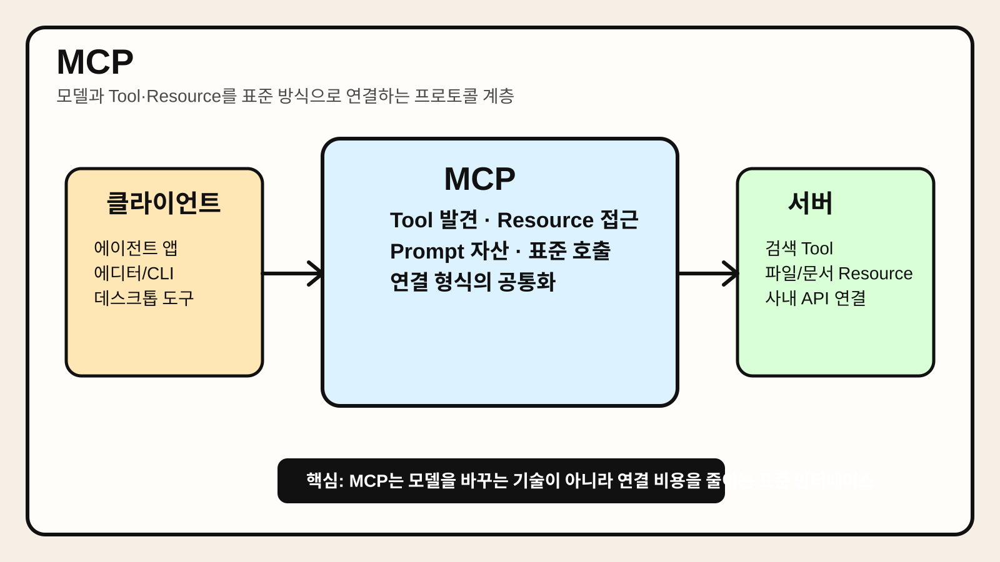

# Chapter 6. MCP



> MCP가 모델 자체를 바꾸는 기술이 아니라, 에이전트가 다양한 Tool과 데이터 소스를 일관된 프로토콜로 연결하도록 돕는 표준 인터페이스라는 점을 시각적으로 요약한 이미지다.

## 1. 왜 중요한가

에이전트가 실무에 들어오면서 가장 빠르게 복잡해진 영역 중 하나는 Tool 연결 방식이다. 프레임워크마다 Tool 정의 방식이 다르고, 데이터 소스마다 인증과 호출 규칙이 다르며, 팀마다 내부 API와 실행 환경이 제각각이다. 처음에는 개별 통합으로 버틸 수 있지만, 연결 대상이 늘어나면 유지보수 비용이 급격히 커진다.

MCP(Model Context Protocol)는 이런 문제를 줄이기 위해 등장한 표준화 시도다. 핵심 아이디어는 단순하다. 모델 또는 에이전트 애플리케이션이 외부 Tool, 리소스, 프롬프트 등을 일관된 방식으로 발견하고 호출할 수 있게 하자는 것이다. 즉, 개별 통합을 모두 애플리케이션 내부에 하드코딩하기보다, 공통 프로토콜을 통해 연결을 분리하려는 접근이다.

실무 관점에서 MCP가 중요한 이유는 "새로운 마법 기능"이어서가 아니다. 오히려 연결 비용을 낮추고, Tool 생태계를 표준화하고, 모델 계층과 도구 계층의 결합을 줄일 수 있기 때문이다. 에이전트 수가 많아질수록 이런 표준 인터페이스의 가치가 커진다.

## 2. 핵심 개념

### 2.1 MCP는 모델이 아니라 연결 규약이다

MCP를 이해할 때 가장 먼저 잡아야 할 점은, 이것이 더 똑똑한 모델을 만드는 기술이 아니라는 사실이다. MCP는 모델과 외부 기능 사이의 상호작용 규약에 가깝다. 쉽게 말해 "어떤 Tool이 있는지", "어떻게 호출하는지", "어떤 리소스를 읽을 수 있는지"를 표준 방식으로 표현하는 계층이다.

이 관점에서 보면 MCP는 프레임워크 경쟁 상대라기보다, 여러 프레임워크와 도구를 이어 주는 공통 언어에 가깝다.

### 2.2 MCP가 다루는 대상

구현과 버전에 따라 표현은 조금 달라질 수 있지만, MCP가 다루는 대표 대상은 다음과 같다.

- **Tools**: 외부 작업을 실행하는 함수형 인터페이스
- **Resources**: 문서, 파일, 데이터처럼 읽을 수 있는 컨텍스트 자원
- **Prompts**: 반복적으로 쓰는 지시문 템플릿이나 작업 맥락
- **Server/Client 연결**: 애플리케이션과 외부 제공자 간의 표준 통신 구조

즉, MCP는 단순 Tool 호출만이 아니라 "에이전트가 사용할 수 있는 맥락 자산 전체"를 구조화하려는 방향을 가진다.

### 2.3 표준화의 가치는 재사용과 분리에 있다

MCP가 유용한 이유는 각 Tool을 한 번 더 추상화하기 때문이다. 예를 들어 어떤 에디터, 데스크톱 앱, CLI, 에이전트 런타임이 같은 MCP 서버를 이해한다면, 같은 Tool 정의를 여러 클라이언트에서 재사용할 수 있다. 반대로 애플리케이션은 특정 벤더 SDK에 덜 묶이게 된다.

물론 표준이 있다고 해서 통합 문제가 모두 사라지는 것은 아니다. 인증, 권한, 네트워크 경계, 성능, 운영 책임은 여전히 개별적으로 설계해야 한다. 하지만 최소한 연결 형식과 발견 방식이 통일되면 생태계 전체의 마찰이 줄어든다.

## 3. 동작 구조

### 3.1 기본 구조

MCP를 가장 단순하게 표현하면 아래와 같다.

```text
에이전트/클라이언트 ↔ MCP 클라이언트 계층 ↔ MCP 서버 ↔ 실제 Tool·리소스·시스템
```

여기서 중요한 점은 모델이 외부 시스템을 직접 이해하는 것이 아니라, MCP 서버가 제공하는 구조화된 인터페이스를 통해 접근한다는 것이다.

### 3.2 일반적인 호출 흐름

보통의 흐름은 다음과 같다.

1. 클라이언트가 연결 가능한 MCP 서버를 인식한다.
2. 서버가 제공하는 Tool, Resource, Prompt 목록을 탐색한다.
3. 현재 목표에 맞는 항목을 선택한다.
4. 필요한 인자를 구성해 호출한다.
5. 서버가 실제 시스템과 통신한 뒤 결과를 반환한다.
6. 에이전트는 반환값을 바탕으로 다음 행동을 결정한다.

이 구조는 애플리케이션이 모든 통합 세부사항을 직접 알지 않아도 되게 만든다.

### 3.3 MCP를 써도 도메인 설계는 여전히 필요하다

MCP가 있다고 해서 Tool 설계 원칙이 사라지지는 않는다. 이름이 모호하거나, 입력 스키마가 과도하게 복잡하거나, 읽기와 쓰기 권한이 뒤섞인 Tool은 MCP 위에서도 여전히 문제를 일으킨다. 즉, MCP는 표준 연결 계층이지, 나쁜 Tool을 좋은 Tool로 바꿔 주는 마법이 아니다.

## 4. 대표 패턴

### 4.1 로컬 워크스테이션 Tool 허브 패턴

개발자 환경에서 파일 시스템, Git, 터미널, 노트 앱, 브라우저 자동화 같은 Tool을 MCP 서버로 노출하는 방식이다. 로컬 작업 자동화와 연구 보조에 유용하다.

장점:

- 데스크톱 환경과의 연결이 쉬워진다.
- 여러 에이전트 클라이언트에서 같은 Tool 세트를 공유하기 좋다.

주의점:

- 로컬 권한 범위가 넓어 보안 관리가 중요하다.
- 실수로 과도한 쓰기 권한을 열기 쉽다.

### 4.2 SaaS/API Gateway 패턴

사내 서비스나 SaaS API를 MCP 서버 뒤에 두고, 에이전트는 MCP를 통해서만 접근하게 하는 구조다. CRM, 이슈 트래커, 문서 관리 시스템과 잘 맞는다.

장점:

- 인증과 권한 정책을 서버 쪽에서 중앙 관리하기 쉽다.
- 여러 애플리케이션이 같은 비즈니스 Tool을 재사용할 수 있다.

주의점:

- 서버 운영 책임이 커진다.
- 네트워크 장애와 지연 시간이 새 병목이 될 수 있다.

### 4.3 Resource-first 패턴

쓰기 Tool보다 읽기 가능한 Resource 제공에 먼저 집중하는 방식이다. 문서 탐색, 정책 검색, 리포지토리 읽기처럼 안전한 활용 범위부터 시작할 때 적합하다.

장점:

- 초기 도입 위험이 낮다.
- 검색과 컨텍스트 주입 품질 개선에 효과적이다.

주의점:

- 실제 실행 자동화 효과는 제한적일 수 있다.

## 5. 실무 적용 포인트

### 5.1 MCP는 통합 전략의 일부로 봐야 한다

MCP를 도입한다고 해서 자동으로 아키텍처가 정리되지는 않는다. 어떤 Tool을 MCP 서버로 공개할지, 어떤 것은 기존 SDK 연결로 둘지, 어디까지를 표준화 대상으로 삼을지 결정해야 한다. 특히 초기에는 자주 쓰는 Tool부터 선별해 도입하는 편이 현실적이다.

### 5.2 인증과 권한은 프로토콜 밖에서도 관리해야 한다

MCP는 연결 방식을 표준화하지만, 보안 정책 전체를 대신해 주지는 않는다. 서버별 인증 방식, 사용자별 권한, 비밀 관리, 감사 로그는 별도 설계가 필요하다. 특히 쓰기 Tool을 제공할 때는 승인 게이트와 실행 기록이 중요하다.

### 5.3 Tool 발견 가능성이 높아질수록 설명 품질이 중요해진다

MCP의 장점 중 하나는 Tool 발견과 재사용이 쉬워진다는 점이다. 하지만 그만큼 설명이 모호한 Tool도 더 넓게 퍼질 수 있다. 이름, 설명, 입력 스키마, 예시를 명확하게 작성해야 에이전트가 안정적으로 선택할 수 있다.

### 5.4 표준화와 단순화는 다르다

MCP를 도입하면 연결 형식은 통일될 수 있지만, 실제 업무 플로우가 단순해지는 것은 아니다. 실패 처리, 타임아웃, 재시도, 데이터 신선도, 비용 통제는 여전히 애플리케이션 로직에서 다뤄야 한다. 즉, MCP는 복잡성을 제거하기보다 복잡성을 더 잘 분리하는 도구에 가깝다.

## 6. 예제 코드

아래 예제는 MCP의 개념을 설명하기 위한 아주 단순한 모의 코드다. 실제 표준 구현체가 아니라, 클라이언트가 서버의 Tool 목록을 보고 특정 Tool을 호출하는 흐름만 보여준다.

```python
from dataclasses import dataclass
from typing import Callable, Dict, Any


@dataclass
class MCPTool:
    name: str
    description: str
    handler: Callable[[Dict[str, Any]], Dict[str, Any]]


class MockMCPServer:
    def __init__(self) -> None:
        self.tools = {
            "search_docs": MCPTool(
                name="search_docs",
                description="내부 문서를 검색한다.",
                handler=lambda args: {"results": [f"검색어: {args['query']}"]},
            )
        }

    def list_tools(self) -> list[dict[str, str]]:
        return [
            {"name": tool.name, "description": tool.description}
            for tool in self.tools.values()
        ]

    def call_tool(self, name: str, args: Dict[str, Any]) -> Dict[str, Any]:
        return self.tools[name].handler(args)


if __name__ == "__main__":
    server = MockMCPServer()
    print("[available tools]", server.list_tools())
    result = server.call_tool("search_docs", {"query": "배포 정책"})
    print("[tool result]", result)
```

이 예제의 핵심은 Tool 구현 세부사항보다, 클라이언트가 표준화된 방식으로 Tool 목록을 발견하고 호출할 수 있다는 점이다. 실제 MCP 환경에서는 서버 프로세스, 통신 채널, 리소스 제공, 권한 관리가 더해진다.

## 7. 주의할 점

첫째, MCP를 만능 상호운용성 해결책으로 보면 안 된다. 표준이 있어도 인증, 네트워크, 버전 차이, 운영 책임은 남아 있다.

둘째, MCP 도입 자체가 목적이 되면 안 된다. Tool 수가 적고 통합 복잡성이 낮다면, 직접 연결이 더 단순할 수 있다. 표준화 비용보다 얻는 이익이 큰지 판단해야 한다.

셋째, MCP 서버가 많아질수록 거버넌스가 중요해진다. 어떤 서버가 어떤 권한을 갖는지, 누가 소유하고 유지하는지, 실패 시 누가 책임지는지 명확해야 한다.

넷째, 표준 프로토콜 위에 있는 Tool도 여전히 좋은 제품 설계가 필요하다. 이름, 설명, 입력 스키마, 부작용 통제가 나쁘면 표준화된 혼란만 늘어날 수 있다.

## 8. 요약

MCP는 모델을 더 똑똑하게 만드는 기술이 아니라, 에이전트와 외부 Tool·리소스를 일관된 방식으로 연결하기 위한 표준 프로토콜 계층이다. 실무에서의 가치는 새로운 능력 자체보다, 통합 비용을 줄이고 재사용성을 높이며 결합도를 낮추는 데 있다.

다만 MCP를 도입해도 Tool 설계, 권한 통제, 운영 책임, 실패 처리 문제는 그대로 남는다. 따라서 MCP는 만능 해법이 아니라, 에이전트 생태계의 연결 구조를 더 건강하게 만드는 기반으로 이해하는 편이 적절하다.

## 9. 용어 정리

- **MCP(Model Context Protocol)**: 모델 또는 에이전트 애플리케이션이 Tool, Resource, Prompt 등을 표준화된 방식으로 발견하고 연결하도록 돕는 프로토콜이다.
- **MCP 서버**: Tool과 리소스를 외부에 제공하는 쪽이다. 실제 시스템과 연결된 인터페이스를 표준 형식으로 노출한다.
- **MCP 클라이언트**: MCP 서버와 통신하며 사용 가능한 Tool이나 Resource를 탐색하고 호출하는 쪽이다.
- **Resource**: 문서, 파일, 데이터처럼 읽을 수 있는 컨텍스트 자원이다. Tool보다 부작용이 적은 경우가 많다.
- **Prompt 자산**: 반복적으로 사용하는 작업 지시나 템플릿을 구조화해 재사용하는 요소다. MCP 생태계에서는 이런 자산도 공유 대상이 될 수 있다.
- **상호운용성(Interoperability)**: 서로 다른 시스템이나 도구가 공통 규약을 통해 함께 동작할 수 있는 성질이다. MCP가 추구하는 핵심 가치 중 하나다.
- **결합도(Coupling)**: 한 시스템이 다른 특정 구현에 얼마나 강하게 묶여 있는지를 나타낸다. MCP는 이런 결합도를 낮추는 데 도움을 줄 수 있다.
- **거버넌스(Governance)**: 누가 어떤 Tool과 서버를 소유하고, 어떤 권한과 정책 아래 운영할지 정하는 관리 체계다. MCP 서버가 늘어날수록 중요해진다.