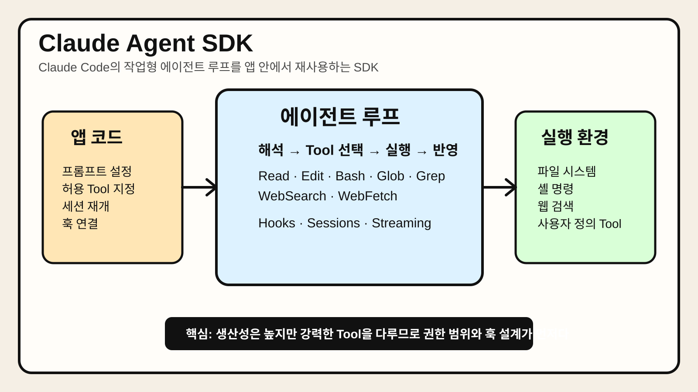

# Chapter 7. Claude Agent SDK



> Claude Agent SDK가 Claude Code의 에이전트 루프를 라이브러리 형태로 노출해, 파일 읽기·편집·명령 실행·웹 접근 같은 기본 Tool과 세션·훅·스트리밍을 코드 안에서 조합할 수 있다는 점을 요약한 이미지다.

## 1. 왜 중요한가

에이전트 프레임워크를 평가할 때 많은 팀이 가장 먼저 부딪히는 질문은 "직접 루프를 짤 것인가, 이미 검증된 루프를 가져다 쓸 것인가"다. Tool 호출, 중간 결과 반영, 권한 통제, 스트리밍 출력, 세션 재개를 모두 직접 구현하면 유연성은 높지만, 운영 복잡성도 빠르게 커진다.

Claude Agent SDK는 이런 부담을 줄이기 위한 선택지다. 핵심은 Claude Code에서 이미 검증된 에이전트 루프를 애플리케이션 안에서 재사용할 수 있게 해 주는 것이다. 즉, 단순한 텍스트 생성 SDK가 아니라 파일 시스템·쉘·검색 같은 Tool을 포함한 "작업형 에이전트 런타임"에 가깝다.

실무에서 중요한 이유는 세 가지다. 첫째, 로컬 코드베이스나 작업 디렉터리를 대상으로 빠르게 자동화 에이전트를 만들 수 있다. 둘째, 훅과 권한 정책을 통해 위험한 작업을 제어하기 쉽다. 셋째, 세션과 스트리밍을 통해 장시간 실행되는 작업형 UX를 구현하기 좋다. 반대로 웹 서비스 백엔드에서 완전히 추상적인 멀티 에이전트 오케스트레이션을 만들고 싶다면, 다른 프레임워크가 더 자연스러울 수 있다.

## 2. 핵심 개념

### 2.1 Claude Code를 라이브러리로 가져오는 접근

Claude Agent SDK는 Claude Code의 도구 사용 방식과 에이전트 루프를 Python·TypeScript 애플리케이션에서 호출할 수 있게 만든다. 따라서 이 SDK의 강점은 "모델 호출 API" 자체보다, 이미 준비된 Tool 실행 환경과 루프 관리에 있다.

공식 문서 기준으로 대표 내장 Tool에는 Read, Write, Edit, Bash, Glob, Grep, WebSearch, WebFetch 등이 포함된다. 즉, 코드 읽기, 파일 수정, 셸 명령 실행, 코드베이스 탐색 같은 작업을 별도 Tool 서버 없이 빠르게 구성할 수 있다.

### 2.2 세션은 단순 대화 기록이 아니라 작업 컨텍스트다

이 SDK에서 세션은 단순 채팅 히스토리보다 더 넓은 개념이다. 프롬프트, Tool 호출, 결과, 에이전트 응답이 함께 누적되며, 이후 세션을 이어서 실행할 수 있다. 실무에서는 이 특성이 중요하다. 긴 디버깅 작업, 점진적 리팩터링, 반복적인 분석 업무에서 이전 실행 맥락을 자연스럽게 이어갈 수 있기 때문이다.

다만 세션이 있다고 해서 장기 메모리 전략이 자동으로 완성되는 것은 아니다. 세션 바깥의 사용자 프로필, 조직 정책, 프로젝트 지식 베이스는 별도 설계가 필요하다.

### 2.3 훅은 통제 지점이다

Claude Agent SDK의 큰 장점 중 하나는 훅이다. Tool 실행 전후, 세션 시작과 종료, 사용자 프롬프트 제출 시점 등에 커스텀 로직을 붙일 수 있다. 이 구조는 단순한 로깅 이상의 의미가 있다.

예를 들어 `PreToolUse` 훅으로 위험한 `rm`, `curl | sh`, 민감한 파일 경로 접근을 차단할 수 있다. `PostToolUse` 훅으로 변경 로그를 남기거나, 특정 편집 패턴을 감지해 사람 승인을 요구할 수도 있다. 즉, 훅은 보안·감사·운영 정책을 주입하는 핵심 지점이다.

### 2.4 강점은 작업형 에이전트, 약점은 프레임워크 중립성 부족

Claude Agent SDK는 "작업을 수행하는 단일 에이전트"에는 매우 강하다. 반면 그래프 기반 분기 제어나 벤더 중립 오케스트레이션을 1순위로 두는 환경에서는 다소 덜 자연스러울 수 있다. 내장 Tool과 Claude Code의 작업 철학이 큰 장점인 동시에, 아키텍처 선택을 어느 정도 그 방향으로 끌고 가기 때문이다.

## 3. 동작 구조

### 3.1 기본 구조

Claude Agent SDK의 기본 흐름은 아래처럼 이해할 수 있다.

```text
애플리케이션 코드
  ↓
Claude Agent SDK
  ↓
에이전트 루프(프롬프트 해석 → Tool 선택 → 실행 → 결과 반영)
  ↓
내장 Tool 또는 사용자 정의 Tool/MCP
  ↓
파일 시스템 · 셸 · 웹 · 외부 시스템
```

핵심은 개발자가 루프 전체를 직접 작성하지 않아도 된다는 점이다. 애플리케이션은 주로 다음을 설정한다.

- 작업 목표 프롬프트
- 허용 Tool 목록
- 권한 모드
- 훅
- 작업 디렉터리 및 세션 전략

### 3.2 일반적인 실행 흐름

보통의 실행 흐름은 다음과 같다.

1. 애플리케이션이 프롬프트와 옵션을 설정한다.
2. SDK가 세션을 시작하거나 기존 세션을 이어받는다.
3. 모델이 필요한 Tool을 선택한다.
4. SDK가 Tool을 실행하고 결과를 다시 모델에 전달한다.
5. 필요하면 여러 차례 반복한다.
6. 최종 결과를 스트리밍하거나 완료 응답으로 반환한다.

이 구조 덕분에 개발자는 개별 Tool 호출과 모델 재호출 사이의 접착 코드를 많이 줄일 수 있다.

### 3.3 권한과 작업 범위는 반드시 좁혀야 한다

실무에서 가장 중요한 설계 포인트는 모델 성능보다 범위 통제다. 어떤 디렉터리에서 동작할지, 어떤 Tool만 허용할지, 어떤 명령은 막을지 정하지 않으면 작은 자동화도 위험해진다. Claude Agent SDK는 강력한 기본 Tool을 제공하는 만큼, "무엇을 허용하지 않을지"를 먼저 설계해야 한다.

## 4. 대표 패턴

### 4.1 코드 수정 에이전트 패턴

가장 대표적인 사용 방식이다. 특정 저장소를 작업 디렉터리로 두고, Read·Edit·Bash·Grep 정도만 허용해 버그 수정, 리팩터링, 테스트 보강 같은 작업을 수행한다.

장점:

- 빠르게 유용한 자동화를 만들 수 있다.
- 코드베이스 탐색과 수정 루프가 자연스럽다.
- 스트리밍 출력이 있어 진행 상황을 보여 주기 좋다.

주의점:

- 쓰기 권한과 셸 권한이 함께 열리면 위험이 커진다.
- 테스트나 검증 단계를 별도로 강제하지 않으면 잘못된 수정이 남을 수 있다.

### 4.2 로컬 워크플로 자동화 패턴

문서 정리, 로그 분석, 리포지터리 요약, 릴리스 노트 생성처럼 로컬 파일과 셸 명령이 중심인 업무에 적합하다. CLI나 데스크톱 앱에서 특히 유용하다.

장점:

- 별도 Tool 서버 구축 없이 시작할 수 있다.
- 개발자 개인 생산성 향상에 바로 연결되기 쉽다.

주의점:

- 개인 환경 권한이 넓어서 실수 범위가 크다.
- 팀 공용 운영 환경으로 옮길 때 재설계가 필요할 수 있다.

### 4.3 승인형 실행 패턴

민감한 Tool 호출 전에는 사람 승인이나 정책 검사를 두는 방식이다. 훅을 활용해 쓰기 작업, 배포 명령, 외부 전송 작업을 중간에서 차단하거나 승인 대기 상태로 전환할 수 있다.

장점:

- 안전성과 감사 가능성이 높아진다.
- 운영 환경으로 확장할 때 거버넌스 설계가 쉬워진다.

주의점:

- 승인 단계가 많아지면 사용성이 나빠질 수 있다.
- 훅 로직이 복잡해지면 프레임워크보다 정책 코드 유지보수가 더 어려워질 수 있다.

## 5. 실무 적용 포인트

### 5.1 Claude Agent SDK는 "앱 내부 작업자"로 볼 때 잘 맞는다

이 SDK는 독립적인 범용 오케스트레이터보다, 애플리케이션 안에서 일하는 작업자 에이전트에 가깝다. 예를 들어 IDE 보조, CI 수정 제안, 운영 로그 분석, 문서 정리 자동화 같은 곳에서 강점을 보인다. 반면 수십 개 역할 에이전트를 정교하게 조율하는 시스템의 핵심 런타임으로는 다른 선택지가 더 적합할 수 있다.

### 5.2 훅과 감사 로그를 처음부터 붙이는 편이 낫다

실무에서는 나중에 보안을 붙이려 하면 거의 항상 비용이 커진다. 처음부터 `PreToolUse`, `PostToolUse` 훅에 차단 규칙과 감사 로그를 넣는 편이 낫다. 특히 Bash와 Write/Edit를 함께 허용할 때는 필수에 가깝다.

### 5.3 세션 재개 전략을 UX와 함께 설계해야 한다

장시간 작업형 에이전트는 "어디까지 했는지"가 중요하다. 사용자가 중간에 세션을 재개할 수 있어야 하는지, 이전 Tool 결과를 얼마나 유지할지, 어떤 시점에 요약해 압축할지 결정해야 한다. 세션 기능이 있다고 해서 UX 문제가 자동으로 해결되지는 않는다.

### 5.4 벤더 종속성을 감수할 가치가 있는지 판단해야 한다

Claude Agent SDK는 강력하지만, 그 강점 상당수가 Claude Code 생태계와 결합돼 있다. 팀이 특정 모델·도구 철학에 묶여도 괜찮은지, 아니면 프레임워크 중립성과 이식성을 더 중시하는지 미리 판단해야 한다.

## 6. 예제 코드

아래 예제는 Claude Agent SDK의 기본 사용 흐름을 설명하기 위한 단순 예시다. 허용 Tool을 좁게 설정하고, 훅으로 위험한 명령을 차단하는 패턴을 보여 준다.

```python
import asyncio
from claude_agent_sdk import query, ClaudeAgentOptions, HookMatcher


async def block_dangerous_bash(input_data, tool_use_id, context):
    tool_name = input_data.get("tool_name", "")
    tool_input = input_data.get("tool_input", {})
    command = tool_input.get("command", "")

    if tool_name == "Bash" and any(token in command for token in ["rm -rf", "curl | sh"]):
        return {
            "decision": "deny",
            "reason": "위험한 셸 명령은 정책상 허용하지 않는다."
        }
    return {}


async def main():
    async for message in query(
        prompt="tests/ 디렉터리의 실패 원인을 찾아 요약하고, 수정이 필요하면 patch.txt에 제안안을 작성해라.",
        options=ClaudeAgentOptions(
            allowed_tools=["Read", "Glob", "Grep", "Bash", "Write"],
            hooks={
                "PreToolUse": [
                    HookMatcher(matcher="Bash", hooks=[block_dangerous_bash])
                ]
            },
        ),
    ):
        print(message)


if __name__ == "__main__":
    asyncio.run(main())
```

이 예제의 핵심은 두 가지다. 첫째, 모든 Tool을 열지 않고 필요한 것만 허용한다. 둘째, Bash를 허용하더라도 훅으로 금지 명령을 차단한다. 실제 운영 환경에서는 작업 디렉터리 제한, 사용자 승인, 실행 로그 저장을 함께 두는 편이 안전하다.

## 7. 주의할 점

첫째, Claude Agent SDK를 단순 모델 SDK처럼 보면 안 된다. 이 도구는 강력한 작업 Tool을 포함하므로, 권한 설계가 빈약하면 위험도도 함께 커진다.

둘째, 내장 Tool이 많다고 해서 도메인 Tool 설계가 불필요한 것은 아니다. 사내 시스템 연동, 승인 플로우, 정책 검사, 감사 기록은 여전히 별도 설계가 필요하다.

셋째, 세션 지속성은 유용하지만 비용과 컨텍스트 비대화 문제를 만든다. 장시간 작업에서는 요약, 압축, 체크포인트 전략이 필요하다.

넷째, SDK가 제공하는 편의성 때문에 특정 벤더와 작업 방식에 깊이 묶일 수 있다. 이후 다른 모델이나 런타임으로 옮길 가능성이 있다면 추상화 계층을 일부 남겨 두는 편이 좋다.

## 8. 요약

Claude Agent SDK는 Claude Code의 작업형 에이전트 루프를 라이브러리로 제공하는 도구다. 파일 읽기·편집, 셸 실행, 코드베이스 탐색, 웹 접근 같은 기본 Tool이 준비돼 있어 로컬 작업 자동화와 코드 작업 에이전트를 빠르게 만들 수 있다.

실무에서의 핵심은 성능보다 통제다. 허용 Tool 범위를 좁히고, 훅으로 위험한 작업을 막고, 세션 재개와 감사 로그를 함께 설계해야 한다. 즉, 이 SDK는 강력한 생산성 도구이지만, 같은 이유로 더 신중한 권한 설계가 필요하다.

## 9. 용어 정리

- **Claude Agent SDK**: Claude Code의 에이전트 루프와 Tool 사용 방식을 Python·TypeScript 라이브러리로 제공하는 SDK다. 작업형 에이전트를 빠르게 구축할 때 유용하다.
- **에이전트 루프**: 모델이 Tool을 선택하고, 실행 결과를 다시 받아 다음 행동을 결정하는 반복 구조다. 에이전트의 핵심 실행 메커니즘이다.
- **Hook**: Tool 실행 전후나 세션 시작/종료 등 특정 시점에 개발자 로직을 끼워 넣는 확장 지점이다. 보안, 감사, 승인 흐름에 특히 중요하다.
- **Permission Mode**: 어떤 Tool 실행이나 편집을 어느 정도까지 허용할지 정하는 정책 개념이다. 강력한 Tool이 있을수록 중요하다.
- **Streaming**: 에이전트의 중간 진행 상황이나 출력 토큰을 순차적으로 받는 방식이다. 장시간 실행 작업의 사용자 경험을 개선한다.
- **Session**: 프롬프트, Tool 호출, Tool 결과, 응답을 포함한 실행 컨텍스트다. 작업을 이어서 수행하거나 재개할 때 중요하다.
- **Built-in Tool**: SDK가 기본 제공하는 Tool이다. Read, Edit, Bash, Glob 같은 기능이 여기에 해당한다.
- **Vendor Lock-in**: 특정 벤더의 SDK나 런타임에 깊이 의존해 다른 선택지로 옮기기 어려워지는 현상이다. 빠른 생산성과 장기 유연성 사이의 균형이 필요하다.
