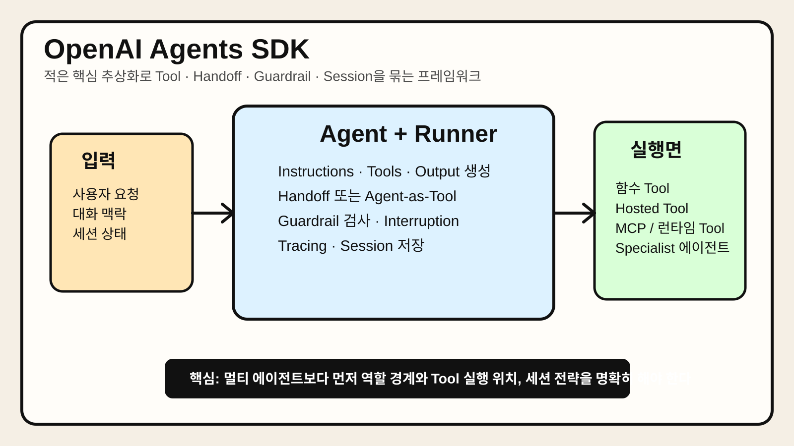

# Chapter 8. OpenAI Agents SDK



> OpenAI Agents SDK가 에이전트, Tool, handoff, guardrail, tracing, session을 비교적 적은 핵심 추상화로 묶어 단일 에이전트와 멀티 에이전트 워크플로를 함께 다룰 수 있다는 점을 시각적으로 정리한 이미지다.

## 1. 왜 중요한가

에이전트 프레임워크가 복잡해지는 가장 흔한 이유는 기능이 많아서가 아니라, 기본 추상화가 너무 많아서다. Tool 호출 방식, 메모리 전달 방식, 멀티 에이전트 위임 방식, 관측성 계층이 각각 따로 놀면 작은 프로토타입은 빨리 만들 수 있어도 실무 시스템은 오히려 불안정해진다.

OpenAI Agents SDK는 이 문제를 비교적 적은 핵심 개념으로 정리하려는 접근이다. 공식 문서 기준으로 중심 추상화는 에이전트, Tool, handoff, guardrail, tracing, session 정도다. 즉, 아주 많은 프레임워크 개념을 새로 배우기보다 Python 코드 안에서 필요한 조합만 올리는 방향에 가깝다.

실무에서 중요한 이유는 세 가지다. 첫째, 단일 에이전트부터 멀티 에이전트까지 같은 SDK 안에서 확장하기 쉽다. 둘째, Tool과 guardrail, tracing이 기본 구조 안에 있어 운영 관점까지 함께 설계하기 좋다. 셋째, session과 interruption 재개 흐름이 있어 다회차 상호작용이나 승인형 워크플로를 만들기 좋다.

## 2. 핵심 개념

### 2.1 작은 추상화 집합으로 구성된 프레임워크

OpenAI Agents SDK의 핵심 철학은 "배워야 할 개념 수를 줄이자"에 가깝다. 에이전트는 지시문과 Tool을 가진 실행 단위이고, Runner는 실제 실행을 담당한다. 나머지 개념은 Tool 확장, 위임, 검증, 메모리, 관측성 같은 축으로 정리된다.

이 접근의 장점은 Python 코드와의 거리가 가깝다는 점이다. 복잡한 DSL이나 그래프 정의를 강제하지 않기 때문에, 이미 있는 애플리케이션 코드에 조금씩 붙이기 좋다. 반면 상태 전이를 매우 명시적으로 제어하고 싶다면 그래프 기반 프레임워크보다 덜 직접적일 수 있다.

### 2.2 Tool은 다층 구조다

이 SDK의 Tool 개념은 단순 함수 호출에만 머물지 않는다. 공식 문서 기준으로 다음 범주를 함께 다룬다.

- Python 함수 Tool
- OpenAI가 호스팅하는 Tool(Web Search, File Search, Code Interpreter 등)
- 런타임 Tool(컴퓨터 사용, 셸 등)
- MCP 기반 Tool
- 에이전트를 Tool처럼 노출하는 방식

즉, 실무에서는 같은 SDK 안에서 "가벼운 함수 호출"과 "외부 런타임 작업"을 함께 구성할 수 있다. 이것이 강점이지만, 반대로 Tool 비용과 실행 위치를 구분하지 않으면 아키텍처가 금방 흐려질 수 있다.

### 2.3 handoff와 agent-as-tool은 비슷해 보여도 다르다

OpenAI Agents SDK를 이해할 때 가장 중요한 포인트 중 하나다. handoff는 대화의 주도권이 다른 에이전트로 넘어가는 방식이다. 반면 agent-as-tool은 상위 에이전트가 통제권을 유지한 채 하위 에이전트를 bounded subtask에 사용한다.

실무적으로 보면 다음처럼 구분하는 편이 이해하기 쉽다.

- **handoff**: 라우팅과 역할 전환이 중요할 때 사용한다.
- **agent-as-tool**: 매니저 에이전트가 결과를 종합하고 최종 답변 책임을 질 때 사용한다.

이 차이를 명확히 구분하지 않으면 멀티 에이전트 구조가 쉽게 혼란스러워진다.

### 2.4 guardrail과 tracing은 선택 기능이 아니라 운영 기능이다

많은 팀이 처음에는 에이전트가 답을 잘 내는지에만 집중하고, guardrail과 tracing은 나중으로 미룬다. 하지만 실무에서는 오히려 이 두 요소가 프레임워크 채택 여부를 좌우하는 경우가 많다.

guardrail은 입력·출력 검증과 안전 정책을 병렬로 수행하게 해 주고, tracing은 에이전트가 어떤 Tool을 어떤 순서로 호출했는지, 어느 단계에서 실패했는지 추적하게 해 준다. 즉, 잘 만드는 것만큼 잘 관찰하고 잘 막는 것이 중요하다.

## 3. 동작 구조

### 3.1 기본 구조

OpenAI Agents SDK의 전형적인 구조는 아래처럼 볼 수 있다.

```text
사용자 입력
  ↓
Agent + Instructions + Tools
  ↓
Runner
  ↓
Tool 호출 / Guardrail 검사 / Handoff 결정
  ↓
Session 저장 · Tracing 기록 · 최종 응답
```

핵심은 Runner가 단일 호출기라기보다, 에이전트 실행 단위를 조율하는 런타임이라는 점이다.

### 3.2 일반적인 실행 흐름

보통의 실행 흐름은 다음과 같다.

1. 애플리케이션이 Agent를 정의한다.
2. 필요한 Tool과 guardrail을 연결한다.
3. Runner가 실행을 시작한다.
4. 모델이 Tool 사용, 응답 생성, handoff 여부를 판단한다.
5. SDK가 Tool 결과와 상태를 반영한다.
6. 필요하면 session에 기록하고 tracing 데이터를 남긴다.
7. 최종 결과 또는 interruption 상태를 반환한다.

이 구조는 단일 에이전트와 멀티 에이전트를 같은 실행 모델 안에서 다루게 해 준다.

### 3.3 session은 메모리 전략의 일부일 뿐 전체가 아니다

공식 문서에서 session은 다회차 실행의 작업 컨텍스트를 자동 저장하는 기능으로 설명된다. 이는 매우 편리하지만, 장기 메모리와 동일하지는 않다. 어떤 히스토리를 얼마나 불러올지, 오래된 기록을 어떻게 줄일지, 사용자별 상태를 어디까지 분리할지는 여전히 애플리케이션이 결정해야 한다.

즉, session은 메모리 전략의 출발점이지 완성형은 아니다.

## 4. 대표 패턴

### 4.1 단일 에이전트 + 함수 Tool 패턴

가장 단순한 방식이다. 하나의 에이전트에 Python 함수 Tool 몇 개를 붙여 업무 자동화나 상담형 워크플로를 구현한다.

장점:

- 학습 곡선이 낮다.
- 기존 백엔드 코드와 통합하기 쉽다.
- 작은 팀이 빠르게 시작하기 좋다.

주의점:

- Tool 수가 늘어나면 에이전트 프롬프트가 비대해질 수 있다.
- 한 에이전트에 역할이 과도하게 몰리기 쉽다.

### 4.2 매니저 + specialist 패턴

상위 에이전트가 specialist 에이전트를 Tool처럼 호출하는 방식이다. 예를 들어 리서치, 계산, 보고서 작성, 검증 역할을 분리할 수 있다.

장점:

- 최종 응답 책임이 한 에이전트에 남아 구조가 단순하다.
- specialist를 좁은 역할에 맞게 최적화하기 쉽다.

주의점:

- 매니저 프롬프트가 지나치게 비대해질 수 있다.
- specialist 결과를 잘못 종합하면 품질 저하가 발생한다.

### 4.3 triage handoff 패턴

처음 들어온 요청을 triage 에이전트가 분류하고, 적합한 specialist로 handoff하는 방식이다. 고객지원, 내부 헬프데스크, 멀티 도메인 도우미에 자주 쓰인다.

장점:

- 역할과 책임이 명확하다.
- specialist 프롬프트를 짧고 선명하게 유지하기 쉽다.

주의점:

- 라우팅 오류가 곧 전체 경험 저하로 이어진다.
- 지나치게 잦은 handoff는 사용자 경험을 끊을 수 있다.

### 4.4 승인형 interruption 패턴

실행 중 민감한 작업이 감지되면 interruption을 만들고, 사람 승인 후 같은 session으로 재개하는 방식이다.

장점:

- 안전한 자동화에 적합하다.
- 운영 감사와 책임 분리가 쉬워진다.

주의점:

- 승인 UX가 어색하면 실제 사용성이 크게 떨어진다.
- 어떤 작업에서 끊을지 기준이 모호하면 운영 혼선이 생긴다.

## 5. 실무 적용 포인트

### 5.1 너무 빨리 멀티 에이전트로 가지 않는 편이 낫다

이 SDK는 handoff와 agent-as-tool을 잘 지원하지만, 그렇다고 처음부터 멀티 에이전트가 정답은 아니다. 많은 경우 단일 에이전트 + 좋은 Tool 설계만으로 충분하다. 역할 분리가 실제로 품질이나 운영성을 높일 때만 멀티 에이전트로 가는 편이 현실적이다.

### 5.2 Tool 실행 위치와 비용 모델을 구분해야 한다

호스팅 Tool, 로컬 함수 Tool, 외부 런타임 Tool은 지연 시간과 비용, 보안 경계가 다르다. 모두 "Tool"이라는 한 단어로 묶여도 운영 특성은 크게 다르므로, 어떤 Tool이 어디서 실행되는지 문서화해야 한다.

### 5.3 tracing은 디버깅 도구이면서 제품 도구다

실패 원인 분석뿐 아니라, 실제 사용자 요청이 어떤 경로로 처리되는지 이해하는 데 tracing이 중요하다. 어느 Tool이 자주 호출되는지, 어떤 guardrail에서 자주 막히는지, 어떤 handoff가 품질 저하를 만드는지 봐야 개선이 가능하다.

### 5.4 session을 쓰면 pruning 전략도 같이 정해야 한다

다회차 대화가 길어질수록 히스토리 관리 비용이 커진다. 공식 문서도 세션 입력 병합과 가져올 히스토리 제한 옵션을 제공한다. 따라서 session을 도입할 때는 "얼마나 기억할 것인가"를 반드시 함께 정해야 한다.

## 6. 예제 코드

아래 예제는 함수 Tool과 guardrail, session을 함께 쓰는 가장 단순한 패턴을 보여 준다. 실무에서는 여기에 tracing과 승인형 interruption을 덧붙이는 경우가 많다.

```python
from agents import Agent, Runner, SQLiteSession, function_tool


@function_tool
def get_order_status(order_id: str) -> str:
    """주문 상태를 조회한다."""
    fake_db = {
        "A100": "배송 준비 중",
        "A200": "배송 완료",
    }
    return fake_db.get(order_id, "주문 정보를 찾지 못했다.")


def output_guardrail(text: str) -> bool:
    banned = ["주민등록번호", "카드번호"]
    return not any(token in text for token in banned)


agent = Agent(
    name="Order assistant",
    instructions="주문 상태를 정확히 안내하고, 모르면 추측하지 않는다.",
    tools=[get_order_status],
)

session = SQLiteSession("order-chat-001")

result = Runner.run_sync(
    agent,
    "주문번호 A100 상태 알려줘.",
    session=session,
)

final_text = result.final_output
if not output_guardrail(final_text):
    raise ValueError("가드레일 위반")

print(final_text)
```

이 예제는 SDK의 전체 기능을 다 보여 주지는 않는다. 대신 에이전트 정의, 함수 Tool 연결, session 유지, 출력 검사를 어떤 식으로 조합하는지 보여 준다. 실제 운영 환경에서는 structured output, tracing, handoff, 더 정교한 guardrail 구성이 추가되는 경우가 많다.

## 7. 주의할 점

첫째, SDK의 핵심 추상화가 적다고 해서 시스템이 자동으로 단순해지는 것은 아니다. Tool 수가 많아지면 설명과 거버넌스가 더 중요해진다.

둘째, handoff와 agent-as-tool을 혼용하면서 역할 차이를 명확히 하지 않으면 디버깅이 매우 어려워진다. 누가 최종 응답 책임을 갖는지 먼저 정해야 한다.

셋째, session은 편리하지만 무제한 히스토리를 뜻하지 않는다. 긴 대화에서는 입력 병합, recent-history 제한, 요약 전략이 필요하다.

넷째, guardrail을 나중에 붙이겠다는 생각은 위험하다. 민감한 출력 차단, 외부 전송 제한, 승인 흐름은 처음부터 설계하는 편이 낫다.

## 8. 요약

OpenAI Agents SDK는 에이전트, Tool, handoff, guardrail, tracing, session 같은 비교적 적은 핵심 개념으로 단일 에이전트와 멀티 에이전트 워크플로를 함께 다루는 프레임워크다. Python 코드와의 거리가 가깝고, 운영 기능이 구조 안에 들어 있다는 점이 강점이다.

실무에서는 멀티 에이전트 자체보다 역할 경계가 더 중요하다. 언제 handoff를 쓸지, 언제 agent-as-tool을 쓸지, 어떤 Tool이 어디서 실행되는지, 세션 히스토리를 얼마나 유지할지 정해야 안정적인 시스템이 된다.

## 9. 용어 정리

- **OpenAI Agents SDK**: 에이전트, Tool, handoff, guardrail, tracing, session을 중심으로 에이전트 애플리케이션을 만드는 Python SDK다.
- **Runner**: 에이전트 실행을 실제로 수행하는 런타임 구성 요소다. Tool 호출, 상태 반영, 결과 반환 흐름을 담당한다.
- **Handoff**: 현재 대화나 작업의 주도권을 다른 specialist 에이전트로 넘기는 메커니즘이다. 라우팅 구조에서 중요하다.
- **Agent-as-Tool**: 한 에이전트를 다른 에이전트가 호출하는 Tool처럼 사용하는 방식이다. 매니저가 통제권을 유지하고 싶을 때 유용하다.
- **Guardrail**: 입력과 출력, 또는 실행 조건을 검증해 위험한 동작이나 부적절한 응답을 막는 장치다.
- **Tracing**: 실행 과정에서 어떤 Tool이 어떤 순서로 호출됐고 어디서 실패했는지 관찰하는 기능이다. 디버깅과 운영 개선에 중요하다.
- **Session**: 여러 번의 실행 사이에 대화와 작업 히스토리를 유지하는 저장 계층이다. 다회차 상호작용에 유용하다.
- **Hosted Tool**: 벤더가 관리하는 실행 환경에서 제공되는 Tool이다. 편리하지만 비용·지연 시간·보안 경계를 따로 이해해야 한다.
