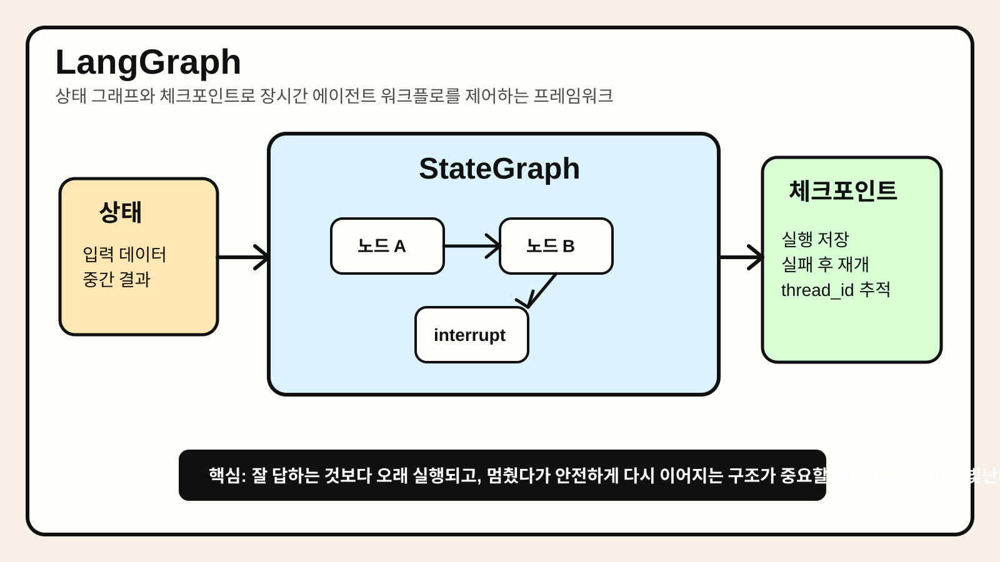

# Chapter 9. LangGraph



> LangGraph가 단순한 "챗봇 래퍼"가 아니라, 상태 기반 그래프와 체크포인트를 이용해 장시간 실행, 재시도, human-in-the-loop, durable execution을 설계하게 해 주는 저수준 오케스트레이션 프레임워크라는 점을 요약한 이미지다.

## 1. 왜 중요한가

많은 에이전트 프레임워크는 빠른 데모에 강하다. 그러나 실무 시스템은 데모와 다르다. 작업이 길어지고, 중간에 사람이 개입해야 하고, 외부 API 실패 후 재개해야 하며, 일부 단계만 다시 실행해야 한다. 이때 가장 먼저 드러나는 문제는 "프롬프트를 잘 쓰는 것"보다 "상태를 어떻게 관리할 것인가"다.

LangGraph는 바로 이 지점에서 강점을 보인다. 공식 문서도 LangGraph를 고수준 에이전트 추상화보다 저수준 오케스트레이션 프레임워크로 설명한다. 핵심 관심사는 durable execution, streaming, human-in-the-loop, persistence다. 즉, 한 번 잘 답하는 모델보다 오래 살아남는 워크플로에 초점을 둔다.

실무에서 중요한 이유는 세 가지다. 첫째, 상태 전이와 분기 구조를 명시적으로 모델링할 수 있다. 둘째, 체크포인트를 통해 실행을 저장하고 재개하기 쉽다. 셋째, interrupt를 이용해 승인형 워크플로나 사람 검토 단계를 자연스럽게 넣을 수 있다. 반대로 아주 단순한 단일 에이전트 챗봇이라면 LangGraph는 다소 무거울 수 있다.

## 2. 핵심 개념

### 2.1 에이전트를 그래프로 본다

LangGraph의 핵심 아이디어는 에이전트 시스템을 선형 루프가 아니라 그래프로 표현하는 것이다. 각 노드는 작업 단계이고, 엣지는 다음으로 이동할 경로다. 상태는 그래프를 따라 흘러가며 업데이트된다.

이 방식의 장점은 제어 흐름이 명확하다는 점이다. 어떤 조건에서 어느 노드로 이동하는지, 어디서 종료하는지, 어디서 재시도하는지 구조적으로 표현할 수 있다. 반면 단점은 설계 책임이 커진다는 점이다. 프레임워크가 대신 생각해 주지 않으므로, 개발자가 상태와 흐름을 분명히 정의해야 한다.

### 2.2 상태와 체크포인트가 중심이다

LangGraph를 이해할 때 프롬프트보다 먼저 봐야 할 것은 상태와 persistence다. 공식 문서는 checkpointer를 설정하면 durable execution을 사용할 수 있다고 설명한다. 즉, 그래프의 각 단계 진행 상황을 저장하고, 실패나 중단 후 이어서 실행할 수 있다.

이 특성은 장시간 작업에서 특히 중요하다. 외부 API 호출 중 실패가 나거나, 사람 승인을 하루 뒤에 받아도, 처음부터 전체를 다시 돌리지 않아도 된다. 다만 이를 제대로 활용하려면 상태 구조를 안정적으로 정의하고, 부작용이 있는 작업을 신중하게 감싸야 한다.

### 2.3 durable execution은 "같은 줄부터 재개"가 아니다

LangGraph 공식 문서에서 실무적으로 매우 중요한 포인트가 있다. 재개(resume)는 중단된 코드 줄부터 그대로 이어지는 개념이 아니다. 적절한 시작 지점부터 replay가 일어나며, 그 과정에서 이전 단계 일부가 다시 실행될 수 있다.

그래서 비결정적 연산이나 부작용이 있는 작업은 task나 적절한 노드 경계 안에서 관리해야 한다. 같은 API 호출이 두 번 나가거나, 같은 파일 쓰기가 중복되면 큰 문제가 되기 때문이다. LangGraph를 안전하게 쓰려면 replay 관점을 먼저 이해해야 한다.

### 2.4 interrupt는 human-in-the-loop의 핵심 장치다

LangGraph의 interrupt는 그래프 실행을 중간에 멈추고 외부 입력을 기다리게 한다. 승인, 수정 요청, 검토, 수동 분류 같은 human-in-the-loop 패턴에 적합하다. 중요한 점은 interrupt가 단순한 예외가 아니라, persistence와 함께 동작하는 정식 제어 흐름이라는 점이다.

실무에서 이 구조는 매우 강력하다. "에이전트가 먼저 초안을 만들고, 사람이 승인하면 배포한다" 같은 워크플로를 자연스럽게 만들 수 있다.

## 3. 동작 구조

### 3.1 기본 구조

LangGraph의 전형적인 구조는 아래처럼 볼 수 있다.

```text
입력 상태
  ↓
StateGraph
  ├─ 노드 A: 계획/분석
  ├─ 노드 B: Tool 실행
  ├─ 노드 C: 검증/재시도
  └─ 노드 D: 승인 대기(interrupt)
  ↓
체크포인트 저장
  ↓
재개 또는 종료
```

핵심은 단순한 "모델 호출 체인"이 아니라, 상태를 가진 실행 그래프라는 점이다.

### 3.2 일반적인 실행 흐름

보통의 흐름은 다음과 같다.

1. 입력 상태를 그래프에 넣는다.
2. 시작 노드에서 작업을 수행한다.
3. 노드 결과가 상태에 반영된다.
4. 조건에 따라 다음 노드로 이동한다.
5. 각 단계는 체크포인트를 통해 저장될 수 있다.
6. interrupt가 발생하면 외부 입력을 기다린다.
7. 같은 thread ID로 재실행하면 이어서 진행한다.

이 구조는 재시도, 수동 승인, 장시간 대기를 포함한 워크플로에 적합하다.

### 3.3 thread ID는 실행 포인터다

공식 문서 기준으로 thread ID는 재개할 상태를 식별하는 포인터 역할을 한다. 같은 thread ID를 다시 사용하면 기존 실행 흐름을 이어받고, 새로운 값을 쓰면 새 스레드가 시작된다. 이 개념은 단순하지만 매우 중요하다. 실무에서는 사용자별, 작업별, 티켓별로 어떤 thread ID 전략을 쓸지 미리 정해야 한다.

## 4. 대표 패턴

### 4.1 명시적 상태 머신 패턴

분류 → 검색 → 생성 → 검증 → 종료 같은 단계를 명시적 노드로 분리하는 방식이다. 가장 LangGraph다운 패턴이다.

장점:

- 흐름이 명확해 디버깅이 쉽다.
- 실패 지점과 재시도 지점을 구분하기 좋다.
- 팀 단위 협업에서 설계 의도를 공유하기 쉽다.

주의점:

- 작은 문제에 적용하면 오히려 과설계가 된다.
- 상태 스키마 설계를 대충 하면 빠르게 복잡해진다.

### 4.2 승인형 human-in-the-loop 패턴

초안 생성 뒤 interrupt로 멈추고, 사람이 승인하거나 수정 의견을 보내면 다시 재개하는 패턴이다. 배포 승인, 고액 결제 승인, 법무 검토 같은 업무에 적합하다.

장점:

- 자동화와 책임 통제를 동시에 잡기 좋다.
- 사람이 중요한 분기점에서 개입할 수 있다.

주의점:

- 승인 응답이 늦어질 때 상태 저장과 만료 전략이 필요하다.
- 재개 시 replay 특성을 이해하지 못하면 중복 작업이 생길 수 있다.

### 4.3 장시간 배치 워크플로 패턴

대규모 문서 처리, 멀티스텝 분석, 외부 API 다중 호출 같은 장시간 작업을 여러 노드로 나누고 checkpoint를 남기며 수행하는 방식이다.

장점:

- 실패 후 전체 재실행 비용을 줄일 수 있다.
- 운영 안정성이 높아진다.

주의점:

- 부작용 작업을 idempotent하게 설계해야 한다.
- durability 모드와 저장소 선택이 성능에 영향을 준다.

### 4.4 하이브리드 패턴

계획과 판단은 LLM에 맡기되, 큰 흐름은 코드로 고정하는 방식이다. 예를 들어 노드 내부에서는 모델이 도구 사용을 결정하지만, 상위 단계 전이는 그래프가 강제한다.

장점:

- 유연성과 통제를 균형 있게 가져갈 수 있다.
- 완전 자율형보다 예측 가능성이 높다.

주의점:

- 어느 수준을 그래프로 고정하고 어느 수준을 모델에 맡길지 설계가 어렵다.

## 5. 실무 적용 포인트

### 5.1 LangGraph는 단순 챗 인터페이스보다 프로세스 자동화에 잘 맞는다

이 프레임워크는 한 번 답을 잘 만드는 것보다, 긴 프로세스를 안전하게 실행하는 데 더 잘 맞는다. 따라서 고객지원 FAQ처럼 단순한 응답형 제품보다, 운영 플로우, 연구 파이프라인, 승인형 업무 자동화에 더 큰 가치가 있다.

### 5.2 replay와 idempotency를 처음부터 고려해야 한다

공식 문서도 durable execution에서 결정성(determinism)과 idempotency를 강조한다. 실무에서는 이것이 거의 필수다. 파일 쓰기, 결제 호출, 이슈 생성, 이메일 발송 같은 부작용 작업은 재실행돼도 안전하도록 설계해야 한다.

### 5.3 상태 스키마가 곧 아키텍처다

LangGraph에서는 상태 구조가 대충이면 전체 시스템도 대충이 된다. 어떤 필드를 누가 갱신하는지, 어떤 단계가 어떤 상태를 소비하는지, 어디까지를 short-term working memory로 둘지 명확히 정의해야 한다.

### 5.4 관측성과 저장 전략을 함께 봐야 한다

체크포인트를 많이 남기면 복구력은 좋아지지만 저장 오버헤드가 커진다. durability 모드, checkpointer 종류, tracing 도구를 함께 설계해야 운영 비용과 안정성의 균형을 맞출 수 있다.

## 6. 예제 코드

아래 예제는 LangGraph의 핵심 개념인 상태 그래프와 interrupt를 매우 단순하게 보여 주는 데모다.

```python
from typing import TypedDict
from langgraph.graph import StateGraph, START, END
from langgraph.checkpoint.memory import InMemorySaver
from langgraph.types import interrupt, Command


class ReviewState(TypedDict, total=False):
    draft: str
    approved: bool


def write_draft(state: ReviewState):
    return {"draft": "초안: 고객 공지문 초안입니다."}


def approval_node(state: ReviewState):
    approved = interrupt(
        {
            "message": "초안을 검토하고 승인 여부를 알려 달라.",
            "draft": state["draft"],
        }
    )
    return {"approved": bool(approved)}


def finalize(state: ReviewState):
    if not state.get("approved"):
        return {"draft": state["draft"] + "\n[승인 거절됨: 수정 필요]"}
    return state


graph = StateGraph(ReviewState)
graph.add_node("write_draft", write_draft)
graph.add_node("approval", approval_node)
graph.add_node("finalize", finalize)
graph.add_edge(START, "write_draft")
graph.add_edge("write_draft", "approval")
graph.add_edge("approval", "finalize")
graph.add_edge("finalize", END)
compiled = graph.compile(checkpointer=InMemorySaver())

config = {"configurable": {"thread_id": "notice-001"}}
first = compiled.invoke({}, config=config)
print(first["__interrupt__"])

# 나중에 같은 thread_id로 재개
second = compiled.invoke(Command(resume=True), config=config)
print(second)
```

이 예제는 production-ready 코드는 아니다. 하지만 LangGraph의 핵심인 "상태 그래프", "체크포인터", "interrupt 후 같은 thread ID로 재개"를 한 번에 보여 준다. 실제 운영 환경에서는 메모리 기반 저장 대신 지속형 checkpointer와 더 엄격한 상태 모델을 사용해야 한다.

## 7. 주의할 점

첫째, LangGraph를 도입한다고 해서 설계가 쉬워지는 것은 아니다. 오히려 흐름과 상태를 더 명시적으로 설계해야 하므로 초기 진입 비용은 높다.

둘째, durable execution을 제대로 이해하지 못하면 중복 부작용이 발생할 수 있다. 재개는 코드 줄 단위 복원이 아니라 replay 기반이라는 점을 기억해야 한다.

셋째, 모든 문제를 그래프로 풀 필요는 없다. 간단한 단일 에이전트 루프에는 더 가벼운 SDK가 적합할 수 있다.

넷째, interrupt를 많이 넣는다고 좋은 human-in-the-loop가 되지는 않는다. 어디서 멈추고 어떤 정보를 사람에게 보여 줄지 UX까지 포함해 설계해야 한다.

## 8. 요약

LangGraph는 상태 기반 그래프와 체크포인트를 중심으로 장시간 실행, 재시도, human-in-the-loop, durable execution을 다루는 저수준 오케스트레이션 프레임워크다. 단순한 프롬프트 체인보다 복잡한 프로세스를 명시적으로 설계하고 운영하고 싶을 때 강점이 크다.

다만 그만큼 설계 책임도 커진다. 상태 스키마, replay 안전성, idempotent 부작용 처리, thread ID 전략, 체크포인트 저장소를 함께 설계해야 한다. 즉, LangGraph의 강점은 마법 같은 자동화가 아니라, 복잡한 워크플로를 구조적으로 다룰 수 있게 해 주는 통제력에 있다.

## 9. 용어 정리

- **LangGraph**: 상태 기반 그래프를 이용해 에이전트와 워크플로를 설계하는 저수준 오케스트레이션 프레임워크다.
- **StateGraph**: 노드와 엣지, 상태 전이를 정의하는 그래프 구조다. LangGraph의 핵심 구성 요소다.
- **Checkpoint / Checkpointer**: 실행 중간 상태를 저장하고 나중에 재개할 수 있게 해 주는 저장 메커니즘이다. durable execution의 기반이다.
- **Durable Execution**: 작업 진행 상황을 저장해 실패나 중단 후 이어서 실행할 수 있게 하는 방식이다. 장시간 워크플로에 중요하다.
- **Interrupt**: 그래프 실행을 멈추고 외부 입력을 기다리게 하는 제어 지점이다. human-in-the-loop 패턴에 쓰인다.
- **Thread ID**: 어떤 실행 흐름의 저장된 상태를 불러올지 식별하는 포인터다. 같은 값을 쓰면 같은 흐름을 재개한다.
- **Determinism**: 같은 입력과 같은 저장 상태에서 같은 결과가 재현되는 성질이다. replay 기반 재개에서 중요하다.
- **Idempotency**: 같은 작업이 여러 번 실행돼도 결과나 부작용이 중복되지 않도록 하는 성질이다. 외부 API 호출과 데이터 쓰기에서 특히 중요하다.
